# SnarkPack Implementation-to-Goal Dependency Graph

This file is generated from `verification-manifest.json`. Edges point from a prerequisite, explicit assumption, or checked contract field to the claim that consumes it.

```mermaid
flowchart LR
  n0["GOAL-ORDER<br/>proved"]
  n1["V1-ABSTRACT-ACCEPTS<br/>proved"]
  n2["V1-ORDERED-PROJECTION<br/>proved"]
  n3["V1-GOAL-PPE<br/>proved"]
  n4["REAL-PREFIX-GOAL<br/>proved"]
  n5["S1-QUANTITATIVE-SOUNDNESS<br/>proved"]
  n6["DEPLOYED-SRS-SOUNDNESS<br/>open"]
  n7["KZG-LEAF-REDUCTION<br/>open"]
  n8["GIPA-FORK-KNOWLEDGE-REDUCTION<br/>open"]
  n9["APP-STATE-MACHINE<br/>proved"]
  n10["APP-SHIPPING-BINDING<br/>proved"]
  n11["SCALAR-MOD-REDUCTION<br/>proved"]
  n12["SCALAR-CACHE-AWARE-REPLACEMENT<br/>proved"]
  n13["SHIPPING-HASH-MOD-REDUCTION<br/>proved"]
  n14["SHIPPING-FIXED-INPUT-COMPUTATIONAL-BOUND<br/>proved"]
  n15["SHIPPING-TO-V1<br/>proved"]
  n16["SHIPPING-TO-GOAL<br/>open"]
  n17["STATEMENT-PROJECTION-CONSTRUCTION<br/>open"]
  n18["CANONICAL-STATEMENT-BINDING<br/>open"]
  n19["V1-COMPLETENESS<br/>proved"]
  n20["SHIPPING-PROVER-REFINEMENT<br/>open"]
  n21["RUST-CALL-CONSTRUCTION<br/>open"]
  n22["DEPLOYED-HASH-TRACE-CONSTRUCTION<br/>open"]
  n23["ADAPTIVE-SHARED-ORACLE-SKELETON<br/>proved"]
  n24["ADAPTIVE-SHA256-COUPLING<br/>open"]
  n25["ADAPTIVE-ADVERSARY-COUPLING<br/>open"]
  n26["EXTRACTED-BUNDLE-COMPOSITION<br/>proved"]
  n27["BUNDLE-LEVEL-COMPOSITION<br/>open"]
  n28["FULL-ADAPTIVE-END-TO-END-FV<br/>open"]
  n29["DECODER-LAYOUT-CONFORMANCE<br/>proved"]
  n30["BOUNDED-CHALLENGE-SAMPLER<br/>tested"]
  n31["V1-BYTE-LOCK<br/>tested"]
  a0["SHA256-SECURITY<br/>assumed"]
  a1["ADVERSARY-QUERY-BOUND<br/>assumed"]
  a2["ADAPTIVE-SHA-QUERY-BOUND<br/>assumed"]
  a3["KZG-FALSE-OPENING-SECURITY<br/>assumed"]
  a4["GIPA-FORK-KNOWLEDGE-SOUNDNESS<br/>assumed"]
  a5["AENEAS-TRANSLATOR<br/>assumed"]
  a6["HAX-FSTAR-TRANSLATOR<br/>assumed"]
  a7["FSTAR-CHECKER<br/>assumed"]
  a8["ARKWORKS-VK-SERIALIZATION<br/>assumed"]
  a9["ARKWORKS-FIELD-SERIALIZATION<br/>assumed"]
  a10["ARKWORKS-AGGREGATE-PROOF-DECODE<br/>assumed"]
  a11["ARKWORKS-CHALLENGE-SERIALIZATION<br/>assumed"]
  a12["BLAKE2B-ROM-SECURITY<br/>assumed"]
  a13["BLS12-377-PAIRING-BILINEARITY<br/>assumed"]
  a14["ARKWORKS-TIPP-PRIMITIVE-SEMANTICS<br/>assumed"]
  a15["ARKWORKS-PREPARED-VK-ROUTE-DECODE<br/>assumed"]
  a16["ARKWORKS-VERIFIER-SRS-ID-LOAD<br/>assumed"]
  a17["ARKWORKS-PREPARED-VK-AIC-PROJECTION<br/>assumed"]
  a18["ARKWORKS-KZG-VERIFIER-EQUATIONS<br/>assumed"]
  a19["ARKWORKS-FR-DIGEST-REDUCTION<br/>assumed"]
  a20["DEPLOYED-BLAKE2B-EXECUTION<br/>assumed"]
  a21["ARKWORKS-PROVER-CURVE-OPERATIONS<br/>assumed"]
  a22["WELL-FORMED-PROVING-SRS<br/>assumed"]
  e0["contract:familyRegistered<br/>stale"]
  e1["contract:canonicalStatementExact<br/>stale"]
  e2["contract:canonicalStatementInjective<br/>stale"]
  e3["contract:vkDigestPreimageInjective<br/>stale"]
  e4["contract:vkDigestExact<br/>stale"]
  e5["contract:statementDigestExact<br/>stale"]
  e6["contract:challengeContextExact<br/>stale"]
  e7["contract:wrapperExact<br/>stale"]
  e8["contract:proofDecodeExact<br/>assumed"]
  e9["contract:validCounts<br/>stale"]
  e10["contract:realPrefixExact<br/>stale"]
  e11["contract:repeatFinalPadding<br/>stale"]
  n0 --> n2
  n2 --> n3
  n3 --> n4
  n3 --> n5
  n4 --> n5
  a1 -.-> n5
  a3 -.-> n5
  a4 -.-> n5
  n5 --> n7
  n6 --> n7
  a3 -.-> n7
  a18 -.-> n7
  a13 -.-> n7
  n5 --> n8
  a4 -.-> n8
  a5 -.-> n9
  n9 --> n10
  n18 --> n10
  a5 -.-> n10
  a19 -.-> n11
  n11 --> n12
  n1 --> n13
  n12 --> n13
  n5 --> n14
  n13 --> n14
  a1 -.-> n14
  a3 -.-> n14
  a4 -.-> n14
  a0 -.-> n14
  a12 -.-> n14
  n1 --> n15
  n10 --> n15
  n18 --> n15
  a5 -.-> n15
  a13 -.-> n15
  a14 -.-> n15
  a17 -.-> n15
  a18 -.-> n15
  a10 -.-> n15
  a11 -.-> n15
  n15 --> n16
  n18 --> n16
  n17 --> n16
  n5 --> n16
  n14 --> n16
  n13 --> n16
  n4 --> n16
  n7 --> n16
  n8 --> n16
  a1 -.-> n16
  a3 -.-> n16
  a4 -.-> n16
  a0 -.-> n16
  a12 -.-> n16
  n2 --> n17
  a5 -.-> n17
  a6 -.-> n17
  a7 -.-> n17
  a8 -.-> n17
  a9 -.-> n17
  a15 -.-> n17
  a16 -.-> n17
  a17 -.-> n17
  n2 --> n18
  n17 --> n18
  a0 -.-> n18
  a6 -.-> n18
  a7 -.-> n18
  a8 -.-> n18
  a9 -.-> n18
  a10 -.-> n18
  a15 -.-> n18
  a16 -.-> n18
  n3 --> n19
  n19 --> n20
  a5 -.-> n20
  a21 -.-> n20
  a11 -.-> n20
  a22 -.-> n20
  n9 --> n21
  n10 --> n21
  n18 --> n21
  n29 --> n21
  a5 -.-> n21
  a6 -.-> n21
  a7 -.-> n21
  a8 -.-> n21
  a9 -.-> n21
  a10 -.-> n21
  a15 -.-> n21
  a16 -.-> n21
  a17 -.-> n21
  n30 --> n22
  n13 --> n22
  a5 -.-> n22
  a11 -.-> n22
  a19 -.-> n22
  a20 -.-> n22
  n18 --> n24
  n17 --> n24
  a0 -.-> n24
  a2 -.-> n24
  n23 --> n25
  n24 --> n25
  n12 --> n25
  n16 --> n25
  n21 --> n25
  n22 --> n25
  a1 -.-> n25
  a2 -.-> n25
  a0 -.-> n25
  a12 -.-> n25
  n9 --> n26
  n15 --> n26
  a5 -.-> n26
  n26 --> n27
  n21 --> n27
  n16 --> n27
  a5 -.-> n27
  n20 --> n28
  n25 --> n28
  n27 --> n28
  n7 --> n28
  n8 --> n28
  n24 --> n28
  a1 -.-> n28
  a2 -.-> n28
  a3 -.-> n28
  a4 -.-> n28
  a0 -.-> n28
  a12 -.-> n28
  a10 -.-> n29
  n1 --> n30
  n18 --> n31
  e0 --> n18
  e1 --> n18
  e2 --> n18
  e3 --> n18
  e4 --> n18
  e5 --> n18
  e6 --> n18
  e7 --> n18
  e8 --> n18
  e9 --> n18
  e10 --> n18
  e11 --> n18
  classDef proved fill:#d8f3dc,stroke:#2d6a4f,color:#081c15
  classDef tested fill:#dbeafe,stroke:#1d4ed8,color:#172554
  classDef open fill:#fee2e2,stroke:#b91c1c,color:#450a0a
  classDef assumed fill:#fef3c7,stroke:#b45309,color:#451a03
  classDef evidencePass fill:#e0f2fe,stroke:#0369a1,color:#082f49
  classDef evidenceStale fill:#fee2e2,stroke:#b91c1c,color:#450a0a
  class n0,n1,n2,n3,n4,n5,n9,n10,n11,n12,n13,n14,n15,n19,n23,n26,n29 proved
  class n30,n31 tested
  class n6,n7,n8,n16,n17,n18,n20,n21,n22,n24,n25,n27,n28 open
  class a0,a1,a2,a3,a4,a5,a6,a7,a8,a9,a10,a11,a12,a13,a14,a15,a16,a17,a18,a19,a20,a21,a22 assumed
  class e8 evidencePass
  class e0,e1,e2,e3,e4,e5,e6,e7,e9,e10,e11 evidenceStale
```

Open graph claims: `DEPLOYED-SRS-SOUNDNESS`, `KZG-LEAF-REDUCTION`, `GIPA-FORK-KNOWLEDGE-REDUCTION`, `SHIPPING-TO-GOAL`, `STATEMENT-PROJECTION-CONSTRUCTION`, `CANONICAL-STATEMENT-BINDING`, `SHIPPING-PROVER-REFINEMENT`, `RUST-CALL-CONSTRUCTION`, `DEPLOYED-HASH-TRACE-CONSTRUCTION`, `ADAPTIVE-SHA256-COUPLING`, `ADAPTIVE-ADVERSARY-COUPLING`, `BUNDLE-LEVEL-COMPOSITION`, `FULL-ADAPTIVE-END-TO-END-FV`. The manifest dependencies keep the explicit modular-reduction budget and the distinct SHA-256 and Blake2b security advantages separate. `SHIPPING-TO-GOAL` is `open` and `FULL-ADAPTIVE-END-TO-END-FV` is `open`. Every F* statement-contract row must carry a source-digest-pinned `pass` result.
