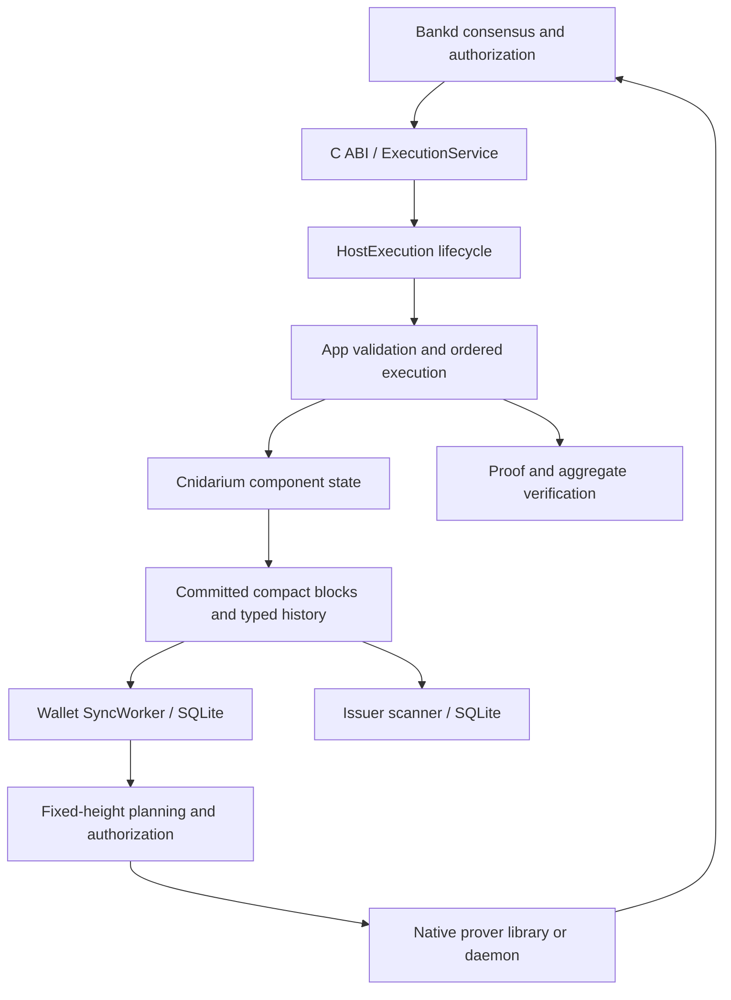

# Runtime ownership

| Boundary | Responsibility |
| --- | --- |
| Bankd | Canonical transaction location, block ordering, authorization, deposits, withdrawal settlement and IBC execution |
| `ExecutionService` / C ABI | Decode typed requests, map errors, own the embedded runtime and expose committed queries |
| `HostExecution` | Enforce legal genesis/begin/deliver/end/commit/rollback phases and bind replay-protected host effects |
| `App` and components | Verify transactions, execute in order, publish roots and compact data atomically |
| Wallet | Validate supplied roots, retain owned witnesses, persist issued addresses and planning state at a fixed height |
| Issuer scanner | Validate canonical block identities, persist detections/evidence, roll back reorgs and bound invalid outcomes |
| Native prover | Build proof artifacts from private witnesses through validated library or daemon transports |

The host supplies height and signed time. State changes remain provisional until
commit; rollback discards the block. Queries use committed snapshots. Component
logic receives `StateRead`/`StateWrite`; external wallet and scanner reads use
`PlanningIo`, `HistoricalWitnessSource`, and `ScannerSource`.

Validator builds verify proofs without enabling native proving. `prover` enables
native proof construction; `bundled-proving-keys` also enables `prover`. Scanner
storage is independent of validator component storage. View’s `rpc` feature adds
the historical-witness RPC adapter.

Bankd owns IBC clients, channels, packets and relay. Shieldd withdrawals carry
a host transfer or execution destination and use the `shielded_withdrawal` proof.
Batch preparation/validation are Rust library capabilities; the C header defines
the exported surface. See [integration](embedded-artifacts.md), [state](state.md),
and [wallet](wallet.md) for each boundary’s details.
