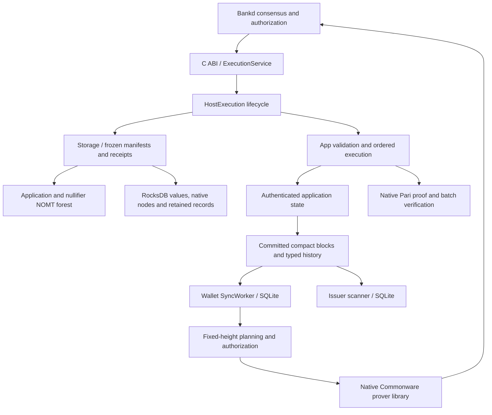

# Runtime ownership

```mermaid
flowchart TD
    Bankd[Bankd consensus and authorization] --> ABI[C ABI / ExecutionService]
    ABI --> Host[HostExecution lifecycle]
    Host --> Writer[Storage / frozen manifests and receipts]
    Writer --> NOMT[Application and nullifier NOMT forest]
    Writer --> Raw[RocksDB values, native nodes and retained records]
    Host --> App[App validation and ordered execution]
    App --> State[Authenticated application state]
    App --> Proofs[Native Pari proof and batch verification]
    State --> Blocks[Committed compact blocks and typed history]
    Blocks --> Wallet[Wallet SyncWorker / SQLite]
    Blocks --> Scanner[Issuer scanner / SQLite]
    Wallet --> Plan[Fixed-height planning and authorization]
    Plan --> Prover[Native Commonware prover library]
    Prover --> Bankd
```

| Boundary | Responsibility |
| --- | --- |
| Bankd | Canonical transaction location, block ordering, authorization, deposits, withdrawal settlement and IBC execution |
| `ExecutionService` / C ABI | Decode typed requests, map errors, own the embedded runtime and expose committed queries |
| `HostExecution` | Enforce legal genesis/begin/native calls/end/freeze/materialize/recover phases and bind replay-protected host effects |
| `App` and components | Verify transactions, execute in order, publish roots and compact data atomically |
| Wallet | Validate supplied roots, retain owned witnesses, persist issued addresses and planning state at a fixed height |
| Issuer scanner | Validate canonical block identities, persist detections/evidence, roll back reorgs and bound invalid outcomes |
| Native prover | Build proof artifacts from private witnesses using the explicit Pari registry |

The host supplies height, canonical block ID and signed time for every block,
including empty blocks. Each failed native mutation restores its application overlay.
Freeze authenticates read observations and produces a canonical manifest and
replay receipt. Bankd's normal SDK Commit makes the sole durable block decision
and stores that receipt atomically with commit metadata. Shieldd materializes the
decided state before Commit returns; public queries wait for a matched boundary.
The next block starts after native persistence completes. Recovery replays native calls without SDK/EVM side effects.
[Storage lifecycle](nullifier-history.md) owns the detailed protocol and operating
rules. Component logic continues to receive `StateRead`/`StateWrite`; wallet and
scanner reads use their existing external-provider boundaries.

Validator builds verify proofs without enabling native proving. `prover` enables
native proof construction using an explicit Pari registry. Scanner
storage is independent of validator component storage. Wallet provider boundaries supply authenticated published nullifier roots.

Bankd owns IBC clients, channels, packets and relay. Shieldd withdrawals carry
a host transfer or execution destination and use the `shielded_withdrawal` proof.
Batch preparation/validation are Rust library capabilities; the C header defines
the exported surface. See [integration](embedded-artifacts.md), [state](state.md),
and [wallet](wallet.md) for each boundary’s details.
