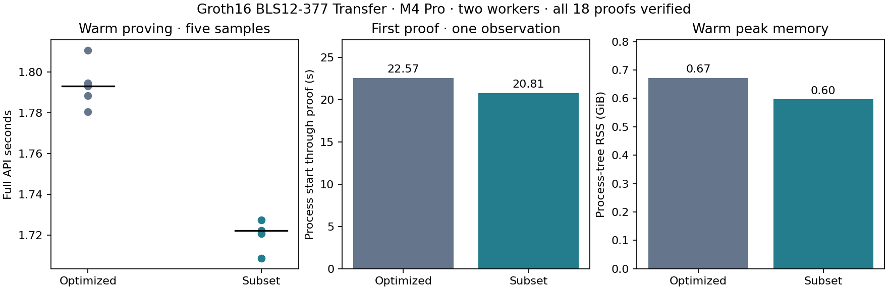

# Subset-domain gnark Groth16 proving

Retain this fair development control for the final comparison. The matched full-API median improves **3.96%**, from 1.793246 to 1.722219 seconds. All five matched warm pairs improve; first use and warm memory also improve. This is a targeted A result, not a newly matched A/B/C matrix.

| Measurement | Existing optimized Groth16 | Subset Groth16 |
| --- | ---: | ---: |
| Warm median | 1.793246 s | 1.722219 s |
| Fresh-process first proof, one observation | 22.572976 s | 20.809473 s |
| Warm peak process-tree RSS | 0.672 GiB | 0.597 GiB |
| Encoded development proving key | 40,732,773 B | 37,587,069 B |
| Encoded verifying key | 540 B | 540 B |
| Complete individual proof package | 436 B | 436 B |

Both workers use the same selected-before-DH BLS12-377 Transfer circuit and gnark v0.15.0 / gnark-crypto v0.20.1 under Go 1.25.7. The M4 Pro has 48 GiB RAM. GOMAXPROCS=2 and gnark's existing internal MSM task configuration/scheduling are preserved. One request runs at a time. Each variant receives three warmups, five warm samples in alternating backend order and one fresh-process first proof. All 18 freshly randomized packages verify individually outside the proving timer and have unique bytes. Complete wall time includes logical-witness decoding/construction, solving, polynomial work, MSMs and encoding. Checked key preparation is inside first use.

The guard exits zero with zero swap and no detected competing heavy jobs. Five warm samples are descriptive; no p95 or confidence estimate is claimed. The first observations include process initialization, but the operating-system page cache was not flushed. This is desktop evidence, with no physical-phone, validator or payment-throughput claim.

## Domain and complete proof path

The original relation remains 155,122 rows / 142,630 wires and one public statement hash, with canonical R1CS digest `cc0dc2091c86777dfd21128b974d1a51f959ce0599211d90a022e5c3d9e27bde`. The 196,608-point domain retains three cosets within the 262,144-point FFT, excluding root indices 1 modulo 4. Its 41,486 padding rows are zero. Setup evaluates every R1CS row against the corresponding retained-point Lagrange basis. It rejects tau at every FFT root, including the excluded coset; this is the precondition for its rational Lagrange formula.

The vanishing query uses the full retained-domain vanishing polynomial and is regenerated with fresh toxic waste. Only Z shrinks by 65,536 points; wire-indexed A/B/K/G2-B query dimensions stay unchanged. Both Z and H consistently use the retained portion of gnark's N-bit-reversed degree order. The complete prover reuses the same solver, randomizers and main MSM scheduling. It explicitly validates every real row before weighted interpolation and the coset quotient; padding is zero by construction. Errors propagate before the MSM stage.

A distinct development proving-key marker and N/removed header precede the ordinary key fields. The reader validates bounded descriptor values and exact canonical FFT-domain bytes, then uses the ordinary checked point decoder and strict canonical roundtrip. Fresh keys receive matching circuit/artifact hashes. Groth16 verification equations and verifying-key/proof encodings remain unchanged: the new setup points bind the changed QAP. This experiment neither loads subset keys into production nor changes production acceptance paths.

Fresh setup took 24.318608 s, excluding 0.436926 s compilation, and passed all six generation proof self-tests. Key generation is separate from first-proof measurement.

## Screening, checks and limitations

The prior component screen uses all six actual solved assignments. Its independent 2N product and sparse vanishing division match all quotient coefficients; retained-point interpolation/padding and altered boundary rows are checked. There are 96 polynomial and 16 Z-query MSM samples, with three warmups and five measured samples per cell. Standard polynomial medians were 115.679709 ms for the pinned gnark computeH wrapper and 137.950042 ms for the checked subset kernel; scenario overhead was 20.10–25.17 ms.

That wrapper includes three defensive input copies inside its timer. Ordinary gnark proving transfers the solved arrays directly, so the screen's baseline includes extra probe overhead. The final matched run above calls the ordinary full workers and has no such added baseline copies. The isolated old-Z count projection measured 433.796042→344.451375 ms on actual old bases/scalars filtered to the proposed count. Those are not fresh subset query points or proofs; the projection justified setup, not a speedup claim. Isolated polynomial/query costs cannot simply be added to predict the complete prover's scheduling.

Four focused Go tests pass, covering complete small proofs, regenerated keys, wrong keys/statements/witnesses/domains, canonical descriptor/domain framing, truncation, Lagrange/query identities and the independent quotient oracle. Three existing worker tests pass, including malformed frames and noncanonical proof-coordinate rejection. All six full-API Transfer scenarios pass positive verification, wrong-key, changed-statement and altered/truncated/trailing-proof gates; the invalid over-limit witness rejects. All 18 timing proofs verify. The unchanged verifier source is byte-identical to pinned gnark. Production release-gated prover suites and formal certification were not run.

Initial source preparation inherited read-only module directories; the following no-matching-tests invocation is explicitly excluded. Corrected preparation and two named component tests passed. A separate full-source patch preparation stopped on an overbroad text-match assertion before compilation; it was corrected by limiting the match to setupABC. These incomplete preparations are not correctness evidence.

Exact source snapshots, dependency identities, raw gate/measurement records, generated-artifact hashes and guard logs are in [the compact checkpoint](../../tools/proving-experiment/checkpoints/2026-09-14-gnark-subset/README.md). Generated keys/proofs/binaries remain in the ignored cache. Re-render with `tools/zkpari-spike/cache/venv/bin/python tools/proving-experiment/report_gnark_subset.py`.

Native Pari381 subset applicability remains to be evaluated before the final combined A/B/C session. Both the A and B subset wins are retained; prior matrices remain immutable.

