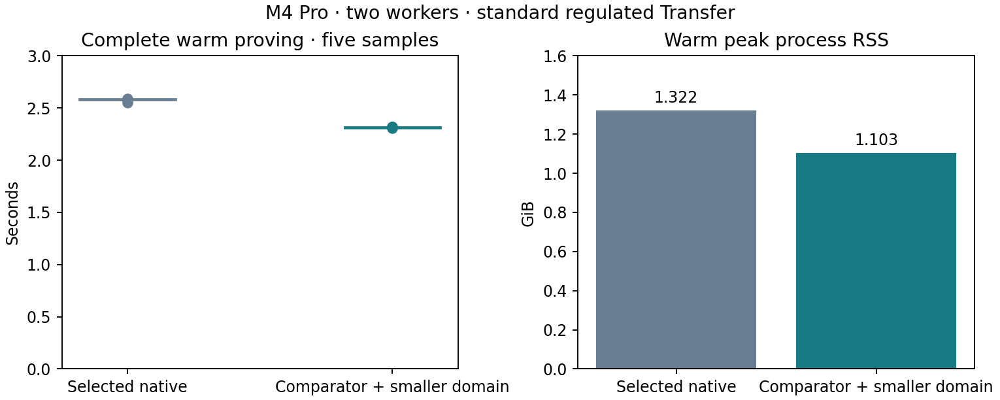

# Native comparator and smaller-domain proving

Retain the comparator and M196608/N262144 domain: the matched quick desktop screen reduces complete warm proving latency by **10.48%**, from **2.582560s to 2.311950s**. The same exact six native Transfer statements remain valid. This is a targeted C comparison; the fair updated A/B comparison remains pending.

| Variant | Warm median(s) | Five-sample range(s) | Warm peak RSS(GiB) | Package bytes |
| --- | ---: | ---: | ---: | ---: |
| Selected native | 2.582560 | 2.551359–2.587675 | 1.322 | 218 |
| Comparator + smaller domain | 2.311950 | 2.306336–2.320961 | 1.103 | 218 |

M4 Pro, two workers, three warmups and five measured complete witness-API requests per variant. Backend order alternates by block. Every request includes checked decoding, live witness construction/solving, prepared assignment mapping, proving and encoding; every output is individually verified outside the proving clock. Sixteen distinct proofs were generated in the warm invocation. Five observations are a quick optimization screen; no p95 or confidence interval is claimed.

Separate startup observations used the same checked sources, keys, binaries, witnesses and two-worker settings: candidate19.586019s once; control22.894164s and23.011949s. These three proofs were preserved and reverified. The startup invocation stopped intentionally to honor the quick-measurement budget; its raw log and exact executing source remain marked incomplete. The warm comparison ran separately. Fresh-process startup includes initialization and first proof, but does not flush the operating-system page cache. Unequal small counts do not establish cold-tail performance.

The native circuit decreases from220009rows/220029columns to191516rows/191501columns (12.95% fewer rows). Retained roots decrease from229376 to196608 while the FFT stays262144. The new proving key is51671551bytes versus60078047bytes (13.99% smaller). One-time setup took21.602919s; it is excluded from request timing. Encoded proof packages stay218bytes.

The domain excludes FFT root indices1 modulo4. Interpolation, four-term vanishing polynomial, masks, coset division, public columns, query lengths, transcript namespaces and checked key descriptors consistently use that relation. Its digest is `722fba7093a6188bba83708f0abe409a39cf34fa4451b95594e82781b68f3783`. The candidate rejects seven-eighths keys rather than interpreting them under the new domain.

Correctness evidence comprises45 relevant release tests across focused invocations; six original/converted full assignments with independent masked-polynomial division and public-column checks; six fresh-key proofs rejecting changed statements, commitments, keys, domains and malformed encodings; and six persistent full-API gates with invalid-witness rejection. Key descriptor tests exercise both sequential and parallel checked decoders. The first build exposed a missing test trait import; another copied test still requested the old domain. Both were corrected and focused reruns pass. No soundness gate was skipped.

All completed guards exited0 without swap or competing heavy jobs. The earlier startup stop was a sample-budget correction, not resource pressure. The desktop library checks ran; a WASM build remains pending. Production release-gated prover tests and formal certification were not run. Production dependencies, circuits, proof formats and acceptance paths are unchanged. These are desktop proving results, without phone acceptability, validator throughput or payment TPS claims.

[Raw checkpoint](../../tools/proving-experiment/checkpoints/2026-09-14-comparator34/README.md) · [Typed result](native-comparator34-proving.json) · [Quick runner](../../tools/proving-experiment/comparator34_quick.py).

