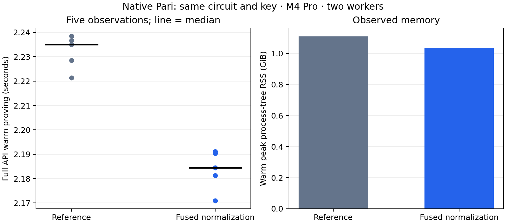

# Fused inverse FFT normalization

The same-key native Pari candidate changes warm full-API proving from **2.235034 to 2.184525 seconds**, a **2.26% time reduction** in this bounded desktop screen. All 18 timing proofs verify.

| Variant | Warm median (s) | First proof (s) | Warm peak RSS (GiB) | API bytes |
| --- | ---: | ---: | ---: | ---: |
| Prepared FFT reference | 2.235034 | 19.776624 | 1.109 | 218 |
| Fused normalization | 2.184525 | 19.514103 | 1.036 | 218 |

The separate exact-output inverse kernel screen measured 52.282541→39.021458 ms against cached FFT powers in both variants. It applied normalization once at the end; the full prover further fuses that factor into existing multiplications. Two kernel tests and all16timed output equalities pass. gnark377 and Arkworks0.6 already normalize once after butterflies, so this change targets the native C implementation.

M4 Pro, two-worker environment. Three warmups and five measured standard-regulated Transfer requests per persistent worker, alternating variant order. One fresh-process first proof per variant includes initialization and its first complete request; OS page cache was not flushed. Single first observations and five warm samples do not support cold-tail or p95 claims.

Warm observations, in execution order:

- control: 2.228452083, 2.238472125, 2.236694542, 2.235034375, 2.221332959 seconds.

- candidate: 2.181330583, 2.191134625, 2.171001750, 2.184525083, 2.190337250 seconds.

The complete request clock includes checked witness decoding, live circuit construction/solving, mapping, proving, encoding and cleanup. Verification is outside that clock and required before admission. Both variants use the same checked comparator3/4 circuit, original proving key, proof format and prepared MSM engine. Circuit/key loading and FFT-table preparation remain in first-process initialization. No new setup was needed.

The existing 8 MiB root tables remain; one inverse-size scalar is added. The private inverse transform omits per-butterfly halves and returns N times the normalized inverse. Subset interpolation incorporates inverse-N into its four weights; quotient recovery incorporates it into its prepared inverse coset powers. Both apply exactly one inverse-N factor without an extra normalization pass. Generic multi-column NTT, verifier code, row checks, masking, quotient degree/remainder checks and proof randomness are unchanged. Preparation remains in initialization. RSS above is observed full process-tree peak.

Five focused Commonware release tests pass: three transform/subset equality and bounds tests plus two existing retained-domain tests. All six actual original/converted polynomial oracle gates pass. Six paired-randomness complete proof cases produce identical bytes under the unchanged generic reference path and the prepared path; changed statements, truncated proofs and invalid witnesses reject. These seeded equality cases are correctness evidence, excluded from the timing corpus. Six additional persistent API gates check valid scenarios, wrong domain, altered/truncated/trailing proof encodings and statements; invalid witness proving rejects. The WebAssembly cryptography build passes. No production release-gated prover suite or formal certification ran.

All samples, proofs, source and artifact identities and resource monitoring remain in the checkpoint. Do not pool these two-variant samples with earlier A/B/C runs. No phone acceptability, verifier-throughput or payment-TPS conclusion follows from this proving screen.

[Raw checkpoint](../../tools/proving-experiment/checkpoints/2026-09-14-fused-inverse/README.md) · [Previous FFT comparison](native-prepared-ntt-proving.md) · [Earlier matched A/B/C](transfer-proving-comparator-selected.md).

