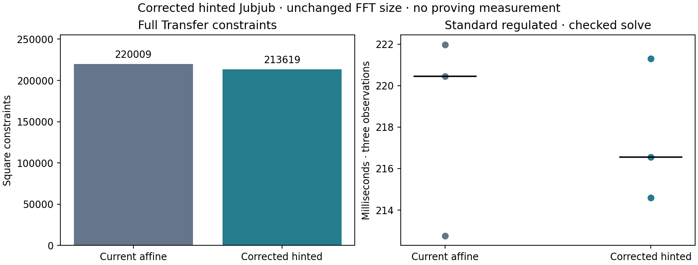

# Corrected hinted-scalar Transfer screen

Retain the corrected gadget as a component; defer new setup and proof timing until a larger combined circuit reduction gives a stronger cost case. Nine native Transfer multiplications save **6,390 constraints (2.90%)**, but M229376/N262144 stays unchanged. Prepared witness timings are broadly unchanged across six scenarios. This does not establish a proving speedup or alter the selected A/B/C proving comparison.

| Count | Current native affine | Corrected hinted |
| --- | ---: | ---: |
| Complete 252-bit variable gadget rows | 5,537 | 4,827 |
| Full Transfer square constraints | 220,009 | 213,619 |
| Full Transfer columns | 220,029 | 213,576 |
| Retained domain | 229,376 | 229,376 |
| FFT domain | 262,144 | 262,144 |

The 12.82% gadget reduction includes signed integer decomposition, 128-bit bounds, six non-native limb equations, bounded carries, nonzero denominator, full cofactor8 output binding and a signed joint multiplication. Both gadgets share the canonical scalar/input-subgroup boundary. Integration replaces two authorization, five audit and two recovery multiplications. Precomputed fixed-base and 129-bit balance paths remain unchanged. Exact Jubjub coordinates and all six existing statements are preserved. [Algebra and call-site argument](native-hinted-scalar-design.md)

| Scenario | Construction, control / hinted (ms) | Prepared mapping, control / hinted (ms) | Complete checked solve, control / hinted (ms) |
| --- | ---: | ---: | ---: |
| transfer | 48.169 / 48.036 | 121.238 / 119.203 | 220.441 / 216.562 |
| transfer_unregulated | 48.659 / 48.887 | 118.797 / 119.315 | 215.131 / 216.754 |
| transfer_flagged | 48.455 / 48.933 | 118.732 / 118.459 | 215.074 / 215.036 |
| transfer_accumulating | 49.517 / 50.041 | 118.188 / 118.898 | 213.579 / 217.475 |
| transfer_over_limit_disclosure | 46.597 / 48.610 | 117.636 / 119.832 | 211.550 / 217.852 |
| transfer_accumulator_continuation | 46.791 / 47.720 | 120.217 / 120.381 | 216.800 / 217.869 |

Each cell is the median of three observations, with no warmups. The control process ran before the candidate. This is a bounded count/solve diagnostic, without balanced backend order or uncertainty estimates; small differences are not reliable speedups. Construction includes live EEA, point multiplication and preimage hints. Prepared mapping uses the same `witness_prepared` path as the retained native prover. Complete checked time additionally includes decoding, both original and converted satisfaction checks and cleanup. It excludes proof construction, keys and cryptographic verification. No phone or throughput claim follows.

Seven release gadget/dynamic tests pass: 4,100 host fraction cases, original/converted group boundaries, malformed numerators/denominators/quotients/signs/carries, a native-field-wrapped integer equality, off-curve/subgroup inputs and outputs, wrong preimages, zero/canonical scalar boundaries, and dynamic witness construction. The even-denominator torsion test first confirms that its wrong output satisfies the unbound MSM, then requires the cofactor-corrected circuit to reject it.

Both full Transfer variants accept all six original and converted assignments, preserve manifest witness/statement hashes and reject the saved invalid witness and an altered statement. Each variant has18 checked solves in the prepared run. An earlier independent unprepared-mapping run also passed18 per variant; it is retained as a correctness gate, not used for production-path timings. The unchanged control reproduces its exact prior relation digest. Sources, locks, parameters, witnesses and optimized binaries are bound by hashes and remain stable throughout each run.

All recorded guards exit0 with zero swap and no competing heavy job; Go/Rayon/Cargo bounds are two on the M4 Pro. Raw process-tree RSS is saved for these count/solve jobs, not presented as proving memory. There were no new setups, real proofs, production release-gated prover tests or formal certification in this screen. Prior proof measurements remain separate.

The initial ordinary binary joint schedule saved only233 rows/site; its source archive and typed output remain cached. The retained signed schedule saves710/site. Further window/profile sweeps are not justified by this result. Applying the method to A/B still requires preserving their exact Decaf representatives; no same-curve Groth16/ZK-Pari gain is claimed here. The next combined candidate should be supported by an actual full-circuit/domain reduction before fresh keys.

[Compact checkpoint](../../tools/proving-experiment/checkpoints/2026-09-14-hinted-scalar/README.md). Reproduce with the [screen runner](../../tools/proving-experiment/hinted_scalar_screen.py); build the isolated `candidates/hinted-jubjub` binaries using Rust1.95, Cargo jobs2 and the shared native target, then run under the existing resource guard with a new cache directory.

