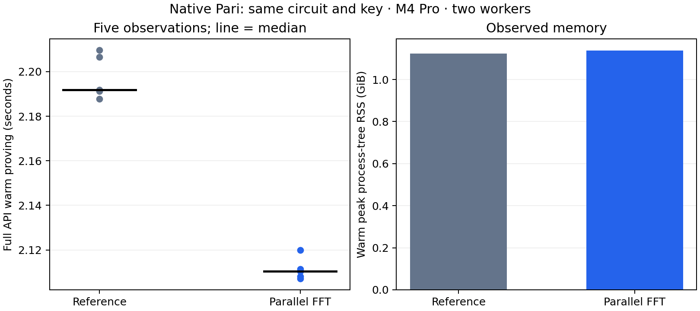

# Bounded parallel native FFT

The same-key native Pari candidate changes warm full-API proving from **2.191940 to 2.110349 seconds**, a **3.72% time reduction** in this bounded desktop screen. All 18 timing proofs verify.

| Variant | Warm median (s) | First proof (s) | Warm peak RSS (GiB) | API bytes |
| --- | ---: | ---: | ---: | ---: |
| Fused-inverse reference | 2.191940 | 19.540297 | 1.124 | 218 |
| Parallel FFT | 2.110349 | 19.440821 | 1.137 | 218 |

The separate exact-output kernel screen measured forward 35.743417→20.092084 ms and inverse 39.264750→22.609209 ms. Both controls already use cached root powers and end normalization. Three kernel tests and all32timed output equalities pass. The screen creates one explicit two-worker pool outside warm clocks; preparation takes 0.085042 ms. The full prover reuses its existing pool.

M4 Pro, two-worker environment. Three warmups and five measured standard-regulated Transfer requests per persistent worker, alternating variant order. One fresh-process first proof per variant includes initialization and its first complete request; OS page cache was not flushed. Single first observations and five warm samples do not support cold-tail or p95 claims.

Warm observations, in execution order:

- control: 2.191199667, 2.209689833, 2.191940291, 2.187839292, 2.206544875 seconds.

- candidate: 2.110349417, 2.108189125, 2.119879750, 2.107223250, 2.111353042 seconds.

The complete request clock includes checked witness decoding, live circuit construction/solving, mapping, proving, encoding and cleanup. Verification is outside that clock and required before admission. Both variants use the same checked comparator3/4 circuit, original proving key, proof format and prepared MSM engine. Circuit/key loading and FFT-table preparation remain in first-process initialization. No new setup was needed.

Each FFT stage uses two disjoint mutable partitions through the existing proving strategy; join completion is its barrier. The final single large butterfly block splits corresponding left/right quarters with the correct second-partition twiddle offset. Dimensions below8192 remain serial. Bit reversal and normalization placement remain unchanged. The 8 MiB root tables and inverse-size scalar are unchanged, and transforms create no pool. Public-column preparation and the polynomial diagnostic remain sequential. Live proving uses the existing two-worker strategy. Generic multi-column NTT, verifier, row checks, masks, quotient degree/remainder checks and randomness are unchanged. RSS above is observed full process-tree peak.

Six focused Commonware release tests pass: transform/subset equality, bounds, one/two-worker behavior across the partition threshold, and two existing retained-domain tests. All six actual original/converted polynomial oracle gates pass. Six paired-randomness complete proof cases produce identical bytes under the unchanged generic reference path and the prepared path; changed statements, truncated proofs and invalid witnesses reject. These seeded equality cases are correctness evidence, excluded from the timing corpus. Six additional persistent API gates check valid scenarios, wrong domain, altered/truncated/trailing proof encodings and statements; invalid witness proving rejects. The WebAssembly cryptography build passes. No production release-gated prover suite or formal certification ran.

All samples, proofs, source and artifact identities and resource monitoring remain in the checkpoint. Do not pool these two-variant samples with earlier A/B/C runs. No phone acceptability, verifier-throughput or payment-TPS conclusion follows from this proving screen.

[Raw checkpoint](../../tools/proving-experiment/checkpoints/2026-09-14-parallel-ntt/README.md) · [Previous normalization comparison](native-fused-inverse-proving.md) · [Earlier matched A/B/C](transfer-proving-comparator-selected.md).

