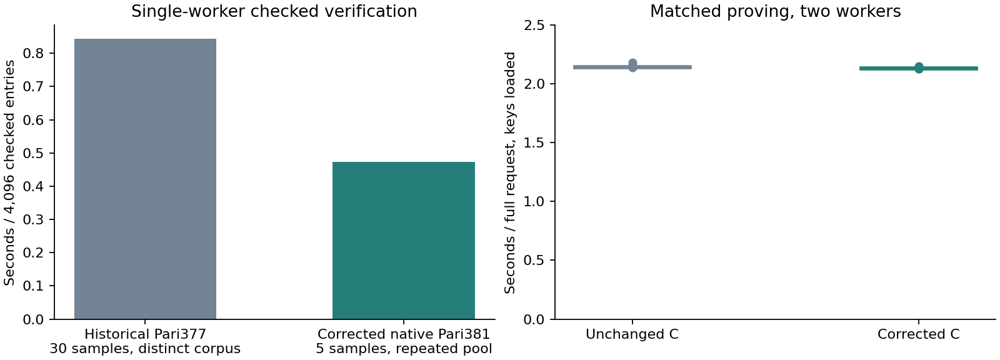

# Corrected native Pari381 comparison

**Constant outlining fixes the native C integration bottleneck without an
observed material proving regression.** Checked verification of 4,096 entries
now takes **0.473 s median** on one desktop worker. Matched full-request proving
takes **2.134 s**, versus **2.146 s** for the unchanged C control on two workers.

| Measurement | Result |
| --- | ---: |
| 16-entry checked batch, median of five | 3.830 ms |
| 4,096-entry checked batch, median of five | **473.145 ms** |
| 4,096-entry cryptographic verifier, median | 89.682 ms |
| 4,096-entry checked preparation, median | 383.585 ms |
| Checked proof entries verified per second, one desktop worker | **8,657** |
| Corrected full-request proving, warm median of five | **2.134 s** |
| Unchanged C full-request proving, warm median of five | 2.146 s |

Component medians need not sum exactly to the median complete request.
The corrected result is an integration measurement, not an isolated curve
comparison, production adoption decision or payment-TPS claim.

## Correction and correctness

The isolated candidate adds a private copy of constant one **after** constant
folding, affine-product optimization, node/assertion compilation and selected
input links. Every existing A/B constant coefficient moves to that column, then
`(1 - w_one)² = 0` is appended. The committed-input prefix is unchanged.

All six real Transfer scenarios passed exact structural row-rewrite checks,
original/outlined satisfaction, assignment extension and projection, changed
selected-input rejection, altered-copy rejection, exact public-row sparsity and
committed-column independence. Their original digest is pinned to the previous
C artifact. The change adds one row and one column:

| Property | Previous C | Corrected C |
| --- | ---: | ---: |
| Square rows | 191,516 | 191,517 |
| Assignment columns | 191,501 | 191,502 |
| Retained/FFT domain | 196,608 / 262,144 | 196,608 / 262,144 |
| Public-column rows touched | 110,079 | **2** |
| Verifier key bytes | 3,964,393 | **539** |
| Prepared proving key bytes | 98,612,487 | 94,648,733 |

Fresh development keys were generated: setup 22.229 s, prepared encoding
1.782 s and checked decode/equality validation 11.937 s, measured separately.
The new relation digest is
`9bd35f891a0d80a594aceaec90fa659704c41ac38d8e896edf0df0ef9d3651b2`.
Old keys and proofs remain preserved and are not accepted as the corrected key's
proofs. Production circuits, dependencies and acceptance paths are unchanged.

Validation completed: **45 focused release tests**, six relation-equivalence
cases, six fresh full-API Transfer proofs with statement/proof/domain/encoding
negatives, invalid-witness rejection, old-key-proof rejection, full-batch positive
and malformed/noncanonical/altered-statement/canonically-invalid-proof checks,
and the Commonware cryptography WebAssembly release build. All 18 additional
proving-comparison proofs verified and had distinct hashes. The initial Python
gate invocation failed on context-manager ownership before any proof; its failure
is retained, and the corrected invocation passed. No production release-gated
prover suite, full upstream workspace suite or formal certification was run.

## Measurement boundaries and proving cost

The verifier screen uses six fresh gated proofs and six distinct statements,
cycled to 4,096 entries. It retains every entry and freshly samples secure upstream
batch coefficients. Hex decoding, canonical/curve/subgroup checks, statement
matching, transcript construction, preflight, randomness and cryptography are
inside the checked timer. Key loading and fixture file I/O are outside. It ran
one warmup and five measurements per size with the `Sequential` strategy.
Repeated input locality and repeated MSM bases remain a limitation; this is not
a 4,096-independent-proof corpus or executable block.

The proving screen used persistent unchanged/corrected C workers, three warmups
and five paired requests with alternating order. Both used two workers. The full
encoded-witness API includes decoding, construction/solving, mapping, local IPC,
proving and encoding. Verification occurs separately. Warm values in seconds:

- Control: 2.139878, 2.141704, 2.165657, 2.145574, 2.181074.
- Corrected: 2.129335, 2.148040, 2.128788, 2.133920, 2.141071.

The median difference is -0.54%; five samples support **no material observed
regression**, not a reliable small speedup. One fresh-process first-use value
was 15.939 s for control and 16.174 s for corrected C; readiness alone was
13.831 s and 14.027 s. These are separate from warm proving and are not cold
OS-cache or tail measurements. Sampled process peaks were about 1,138.2 MiB and
1,139.0 MiB. Resource guards saw no swap or competing heavy workload.

**The corrected phone prover was not rerun.** The prior 8.48 s phone result
belongs to the previous C relation. The desktop comparison suggests low impact,
but it is not a new phone measurement.

## Historical network-cost comparison

The historical one-worker Pari377 checked median was 0.842777 s, so this screen's
checked median is **1.78× faster**. Its cryptography alone is approximately 29%
slower than the historical 0.069502 s; faster checked preparation explains the
net improvement. Relations, libraries, key/claim formats, proof diversity and
measurement runs differ. This is not a curve-only win or loss.

Using historical checked SnarkPack aggregation `G = 24.2721638125 s`, checked
aggregate verification `Vs = 0.076749521 s`, and corrected C checked verification
`Vc = 0.473144709 s`:

| Sum of worker wall-time costs | Groth16/SnarkPack | Corrected C | Baseline / C |
| --- | ---: | ---: | ---: |
| `G + 3Vs` versus `3Vc` | 24.502 s | 1.419 s | **17.26×** |
| Proposer also verifies: `G + 4Vs` versus `4Vc` | 24.579 s | 1.893 s | **12.99×** |

SnarkPack's aggregate verifier alone remains faster; the modeled total saving
comes from avoiding aggregate construction. These are sums of historical and
current per-worker observations, not measured committee latency or end-to-end
throughput. Parallel scheduling, network, execution and consensus are excluded.

[Raw batch samples](../../tools/proving-experiment/checkpoints/2026-09-14-native-outlined381/native-outlined-batch/results4096.json),
[matched proving samples](../../tools/proving-experiment/checkpoints/2026-09-14-native-outlined381/native-outlined-desktop/samples.jsonl),
[arithmetic](../../tools/proving-experiment/checkpoints/2026-09-14-native-outlined381/comparison.json), and
[source/artifact hashes](../../tools/proving-experiment/checkpoints/2026-09-14-native-outlined381/source-identity.json)
are retained. [Reproduction](../../tools/proving-experiment/candidates/native-outlined381/README.md)
describes the isolated candidate. The [prior integration diagnostic](native-pari381-batch-screen.md)
and [audit](native-pari381-integration-audit.md) preserve the cause and correction rationale.
