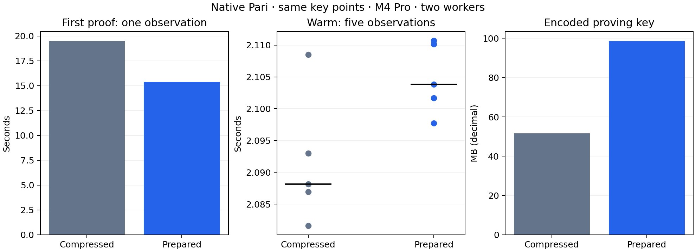

# Native Pari prepared proving-key storage

The first complete proof took **19.498154→15.382319 seconds** in this bounded desktop comparison (21.11% lower). Warm median changed **2.088150→2.103834 seconds** (+0.75%). Stored key bytes increase **51,671,551→98,612,487**. These are the same key points and proving algorithm.

| Storage | Warm median (s) | First proof (s) | Warm peak RSS (GiB) | API bytes |
| --- | ---: | ---: | ---: | ---: |
| Compressed queries | 2.088150 | 19.498154 | 1.128 | 218 |
| Prepared queries | 2.103834 | 15.382319 | 1.086 | 218 |

M4 Pro, two workers. Each persistent worker receives three warmups and five measured standard regulated Transfer requests, alternating backend order. One fresh-process first proof per variant includes initialization; OS page cache was not flushed. Five warm samples and one first observation do not support p95, cold-tail or strong confidence claims.

The full request clock includes checked witness decoding, construction, solving, mapping, proving, encoding and cleanup. Verification and cross-verification are outside that clock. All 18 fresh timing proofs verify under both key representations. Six valid witness scenarios and altered statement, malformed proof, wrong domain and invalid-witness cases pass before timing.

Only four nonidentity proving-query roles use canonical 96-byte storage instead of compressed 48-byte storage: sparse witness entries, quotient, opening A and opening R. Verifying keys, commitment keys and masks retain their original codecs and identity policies. The checked loader enforces format and relation binding, vector bounds, ordered sparse indices, canonical encoding, curve membership and subgroup membership. Safe blst conversions construct projective points after validation. No new setup or protocol encoding is introduced.

Offline conversion of all 977,936 query points measured source checked loading 14.639158s, encoding 0.106423s, prepared checked loading 11.240833s and remaining equality/negative validation 7.047287s. The recorded total 33.085568s ends before final output-file writes; it is not an end-to-end I/O measurement. Full decoded-key equality and exact original canonical bytes match. Eight actual-scale invalid-key cases reject before the prepared file is admitted.

Two component codec tests and five focused Commonware release tests pass. The 1,024-real-query-point component screen preserved checked canonical/curve/subgroup validation and exact outputs. Six paired-randomness complete proofs match the generic arithmetic reference byte for byte. Existing actual-relation polynomial gates are reused because arithmetic is unchanged. The scoped cryptography WebAssembly build passes. No production release-gated prover suite or formal certification ran.

Warm observations, in execution order:

- control: 2.086951125, 2.081615500, 2.108481125, 2.092992208, 2.088150209 seconds.

- candidate: 2.110148292, 2.097737250, 2.103833792, 2.110699417, 2.101655625 seconds.

Retain this development storage option when faster initialization justifies the additional local key storage and distribution bytes. It does not establish a warm proving improvement, phone acceptability, verifier throughput or payment TPS. Earlier A/B/C and FFT comparisons remain separate samples.

[Raw checkpoint](../../tools/proving-experiment/checkpoints/2026-09-14-prepared-key381/README.md) · [Previous FFT comparison](native-parallel-ntt-proving.md).

