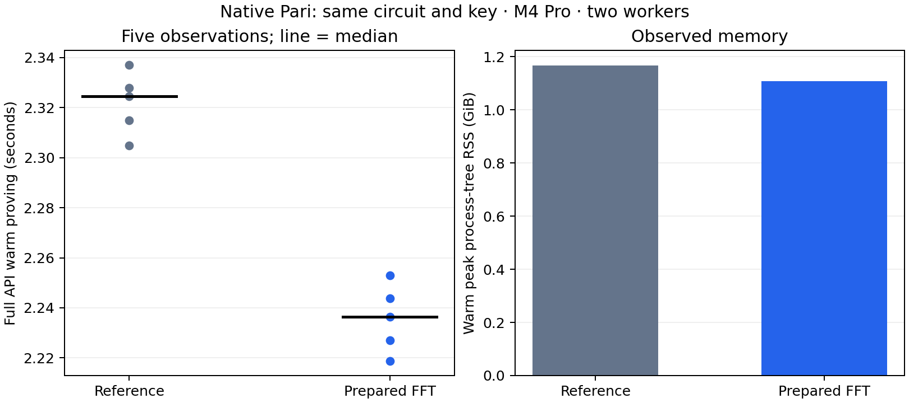

# Prover-owned FFT preparation

The same-key native Pari candidate changes warm full-API proving from **2.324596 to 2.236445 seconds**, a **3.79% time reduction** in this bounded desktop screen. All 18 timing proofs verify.

| Variant | Warm median (s) | First proof (s) | Warm peak RSS (GiB) | API bytes |
| --- | ---: | ---: | ---: | ---: |
| Comparator3/4 reference | 2.324596 | 19.869731 | 1.167 | 218 |
| Prepared FFT | 2.236445 | 19.483095 | 1.109 | 218 |

M4 Pro, two-worker environment. Three warmups and five measured standard-regulated Transfer requests per persistent worker, alternating variant order. One fresh-process first proof per variant includes initialization and its first complete request; OS page cache was not flushed. Single first observations and five warm samples do not support cold-tail or p95 claims.

Warm observations, in execution order:

- control: 2.337105041, 2.328014042, 2.315032042, 2.304810917, 2.324596333 seconds.

- candidate: 2.236445167, 2.243889042, 2.253023541, 2.227069166, 2.218841334 seconds.

The complete request clock includes checked witness decoding, live circuit construction/solving, mapping, proving, encoding and cleanup. Verification is outside that clock and required before admission. Both variants use the same checked comparator3/4 circuit, original proving key, proof format and prepared MSM engine. Circuit/key loading and FFT-table preparation remain in first-process initialization. No new setup was needed.

One immutable forward/inverse table pair per prover uses 8 MiB. Subset interpolation and quotient transforms reuse those tables. Generic multi-column NTT, verifier code, relation checks, masking, quotient degree/remainder checks and proof randomness are unchanged. The earlier isolated table construction cost was 3.451 ms; it is not subtracted from first-process measurements. RSS above is the observed full process-tree peak, not merely table storage.

Five focused Commonware release tests pass: three transform/subset equality and bounds tests plus two existing retained-domain tests. All six actual original/converted polynomial oracle gates pass. Six paired-randomness complete proof cases produce identical bytes under the unchanged generic reference path and the prepared path; changed statements, truncated proofs and invalid witnesses reject. These seeded equality cases are correctness evidence, excluded from the timing corpus. Six additional persistent API gates check valid scenarios, wrong domain, altered/truncated/trailing proof encodings and statements; invalid witness proving rejects. The WebAssembly cryptography build passes. No production release-gated prover suite or formal certification ran.

All samples, proofs, source and artifact identities and resource monitoring remain in the checkpoint. Do not pool these two-variant samples with earlier A/B/C runs. No phone acceptability, verifier-throughput or payment-TPS conclusion follows from this proving screen.

[Raw checkpoint](../../tools/proving-experiment/checkpoints/2026-09-14-prepared-ntt/README.md) · [Kernel screen](prepared-ntt-screen.md) · [Earlier matched A/B/C](transfer-proving-comparator-selected.md).

