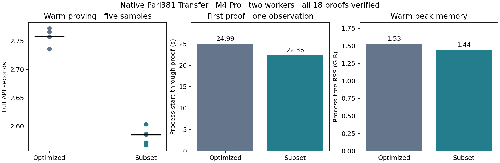

# Native Pari381 subset-domain proving

Retain the native subset candidate. The matched full-API warm median improves **6.27%**, from 2.758030 to 2.585017 seconds. Every matched warm pair improves; first use and warm memory also improve. This is a targeted C comparison against the immutable lifetime-optimized worker. Earlier A/B/C and pair sessions are not pooled with it.

| Measurement | Lifetime-optimized Pari381 | Subset Pari381 |
| --- | ---: | ---: |
| Warm median | 2.758030 s | 2.585017 s |
| Fresh-process first proof, one observation | 24.990656 s | 22.364764 s |
| Warm peak process-tree RSS | 1.528 GiB | 1.442 GiB |
| Encoded proving key | 66,369,503 B | 60,078,047 B |
| Encoded verifying key | 4,595,977 B | 4,595,977 B |
| Complete individual proof package | 218 B | 218 B |

The M4 Pro has 48 GiB RAM. Both ordinary workers use Rust 1.95.0, two Rayon workers and the same resident combined blst arithmetic. Allocation instrumentation is disabled. Three warmups and five measured warm requests per variant alternate backend order; each variant also receives one fresh-process first proof. All 18 proofs verify individually outside the proving timer and have unique bytes. Wall time includes logical-witness decoding, construction/solving, checked mapping, claim construction, polynomial work, MSMs, encoding and cleanup. First use includes relation compilation, canonical checked key loading and arithmetic preparation.

All run guards exit zero, with zero swap and no detected competing heavy jobs. These five warm samples are descriptive diagnostics; no p95 or confidence claim follows. First use is one observation per variant, with no OS page-cache flush. There are no physical-phone, validator or payment-throughput measurements here.

## Domain, padding and protocol binding

The full affine Transfer still has 220,009 square rows and 220,029 unpadded columns. Its canonical rows/layout rehashed under the previous namespace and FFT capacity exactly reproduce `398dd216bcbb0af317026700461f292426e2b46949035772e0c05466c779fedd`. This checks more than matching row counts. The subset relation digest is `80915f4d2181d1a6ff31c9d17b5855f665946b466fd66e9e7f10660c213a17d5`.

Retained size M=229,376 determines FFT size N=262,144 and excludes the 32,768 roots at indices 1 modulo 8. The compiler pads assignments to M; all real columns fit. The domain wrapper explicitly uses N for FFT/coset arithmetic and M for interpolation, row ordinals, vanishing degree and query bounds. Decoder, witness lengths and public-row bounds enforce the same canonical domain rule. They do not silently round M up to N.

Setup regenerates retained-root Lagrange weights and all vanishing-dependent bases. Public A and B columns use the same retained row order. Exact real/padding row checks precede the prepared coset quotient. The complete vanishing polynomial appears in both A-mask terms, the B mask formed from all committed-block openings, the quotient and both openings. Lagrange evaluation handles retained and excluded FFT roots without a rational 0/0 shortcut. Generic masked-product division remains an independent remainder-checking path.

Separate relation, verifying-key and commitment-key namespaces, a new transcript marker and the `SHNCS001` proof package identify this experimental protocol. Key digests bind the actual public columns, domain and block keys. Checked canonical, curve and subgroup decoding remain enforced. The original lifetime optimization and complete affine circuit are preserved. Production dependencies, acceptance paths and bundled artifacts are unchanged.

Logical witness-query padding shrinks by 32,768 slots, but those zero bases were already implicit in key encoding and omitted by prepared arithmetic. The **measured encoded-key saving is 6,291,456 bytes**, exactly 131,072 fewer Q/A/R points at 48 bytes each. Do not claim 163,840 fewer encoded or nonidentity bases. Actual RSS is measured independently.

Fresh setup took 25.121745 s, separate from first use. The standalone gate's single-thread checked load is not the ordinary worker's prepared two-worker initialization measurement.

## Correctness and selection evidence

All 44 native release tests pass, including the prior compliance, encoding, scalar, affine, mapping, accumulator and lifetime tests plus new subset-domain tests. Three focused prepared tests also pass with a valid-proof alternate-domain audit. The initial build stopped on a missing explicit scalar type and an unused import; corrected builds/tests passed, and both logs are retained.

The actual six-assignment polynomial screen checks original and converted relations, the previous-domain digest, complete masked quotient coefficients against independent product/division, and both prepared public columns. It records 96 samples: three warmups and five measured samples per scenario/domain. Standard complete polynomial medians are 419.968792→440.911042 ms; six-scenario overhead is 20.94–29.49 ms. This includes row checks, interpolation, public combination, both masks and both openings. The reference retains the existing prepared full-FFT algorithm. It is a polynomial-stage diagnostic, not a pre-solved witness claim about full proving time.

Fresh development keys then pass all six complete Transfer proof gates: changed public statement, wrong commitment, wrong key, different domain, noncanonical/truncated/trailing proofs and invalid witness rejection. Six logical-witness full-API gates pass using resident combined arithmetic, including rejection of an otherwise valid proof under a different domain. The 18-proof timing comparison follows these gates. Production release-gated prover suites, formal certification and physical-phone testing were not run.

The initial archive assembly mixed relative and absolute source paths. It did not change executable sources or invalidate timing. Assembly was deferred during measurement, then paths were normalized; every compiled Rust source, lock and binary was checked against the pre-key snapshot. The final patch passes forward checking against the lifetime baseline and reverse checking against the measured source. Initial recipes, source archives, raw evidence and artifact hashes are retained in [the compact checkpoint](../../tools/proving-experiment/checkpoints/2026-09-14-native-subset/README.md); generated keys, binaries and proofs remain outside Git.

A single matched session with the retained A/B/C winners follows this round. Broader preparation/ownership and circuit/arithmetic research remains explicitly open; this result does not exhaust the authorized optimization campaign.

