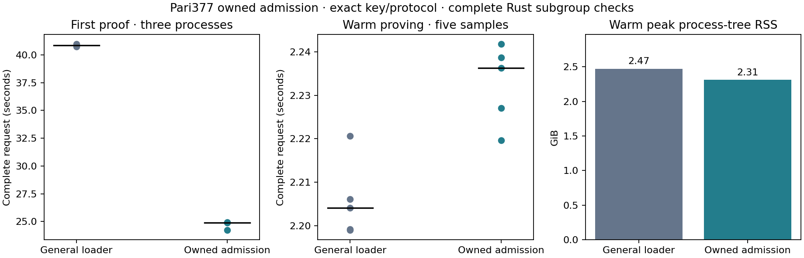

# Pari377 owned arithmetic admission

Retain the owned-admission candidate for the desktop experiment. The median of three complete first proofs changes from **40.877331 to 24.917130 seconds** (39.04% lower). Warm proving is 2.204110 versus 2.236299 seconds. The observed warm median is 1.46% higher; warm peak process-tree RSS is 6.49% lower. Retention favors the substantial startup/storage benefit despite this small measured warm regression. These values come from one targeted matched session; earlier prepared-key and A/B/C sessions are not pooled or rewritten.

| Measurement | Prepared-key / general Go loader | Owned checked admission |
| --- | ---: | ---: |
| Three first-proof observations | 40.734270, 40.989159, 40.877331 s | 24.218132, 24.934972, 24.917130 s |
| First-proof median | 40.877331 s | 24.917130 s |
| Warm median, five requests | 2.204110 s | 2.236299 s |
| Warm peak process-tree RSS | 2.473 GiB | 2.312 GiB |
| First-proof peak RSS, maximum of three | 2.276 GiB | 2.068 GiB |
| Encoded prepared key | 108,633,744 B | 108,633,744 B |
| Additional resident-base files required at startup | 109,764,812 B | 0 B |
| Individual proof package | 168 B | 168 B |

Both variants use the exact same prepared subset key and protocol. The candidate generates no setup/key material and needs no additional format conversion. The prior [prepared-key conversion](pari-prepared-key.md) and its storage cost still apply to both variants. The control additionally reads its resident-base files and a 1,933-byte manifest; the candidate streams directly from the validated key and needs neither. Historical files remain in the ignored cache for reproducibility. Binary and library footprints are not included in these key/base byte counts.

## What changed and what establishes trust

Rust remains the external key-admission boundary. An opaque immutable checked-key record is constructible only through complete bounded canonical decoding and deterministic curve/subgroup validation. It then passes actual Transfer matrix/index and domain association before delegation. A raw constructed key cannot enter this path. Verifying-key checks, proof transcript, masks, statements and cryptographic key points are unchanged.

The checked parent creates a private stdin bootstrap pipe and a separate inherited Unix socket for subsequent commands. The external witness/proof API cannot forward caller-supplied bootstrap points, flags or cached manifests. The private child has no file-loader mode. Bootstrap metadata binds curve/protocol, domain, exact verifying-key/index/source-key digests, a fresh session nonce, and ordered query lengths/content. Go enforces bounded strict framing, canonical coordinates, curve membership, query order/counts and content integrity. The complete Rust subgroup check supplies subgroup provenance; hashes are framing/identity integrity, not authentication of an arbitrary cache or local caller. The existing general Go loader is unchanged and keeps all its checks.

The parent moves each query vector into a bounded streaming writer and frees it before the next query. Go keeps the same combined witness/quotient and opening-A/opening-R arrays. Rust retains the two mask points. Bootstrap must end at EOF before readiness; the parent accepts only the receipt bound to this exact key/session. Typed query identifiers and recorded lengths replace Rust point-slice pointer checks. Any command/framing/child failure poisons and terminates the delegated instance. Partial admission cannot be restarted or used for proving. Both returned 97-byte MSM points still receive complete canonical, curve and subgroup checking.

This is a trust boundary inside the owned desktop process tree. The private arithmetic child is not a standalone validator for arbitrary callers. It does not change production acceptance paths or add a public unverified loader. Logical vector release is not itself an RSS result; the table reports sampled actual process-tree memory, including allocator retention and child processes.

## Correctness and execution evidence

Eighteen Rust tests pass, including immutable checked admission, matrix/key association, transfer-state rejection, canonical/torsion key cases, malformed frames and wrong child acknowledgement/session rejection. Six private Go bootstrap tests pass for metadata/domain/count/order, content digests, canonical/off-curve points, EOF/truncation/trailing data, no public file mode, combined-array sharing and actual MSM behavior. The three unchanged general-loader tests pass. The separately gated actual-child integration test was explicitly run: exact seeded proof parity, wrong-session rejection, command failure, poisoning and subsequent proof rejection all pass.

The exact existing Transfer key then passes six real solved-assignment comparisons against the frozen prepared-key Rust protocol: complete seeded proof bytes, the mask MSM and both combined MSM outputs agree exactly. Original and converted assignments are checked. Fixed randomness is confined to this equality diagnostic; ordinary API measurement uses fresh randomness. All six logical-witness API scenarios and statement/domain/proof/witness negatives pass before measurement.

The paired timing run has three warmups, five measured warm requests and three fresh-process first proofs per variant:22 new unique proof bytes, all individually verified. The original18 paired-session proofs also verify under the other worker. First-process order is candidate/control, control/candidate, candidate/control. Warm blocks alternate order, with one active proof at a time. Complete first use includes process creation, relation compilation, checked key loading, hashing/streaming/child admission, witness processing and the first proof. Warm time includes the complete witness API, solving/mapping, polynomial work, IPC, MSMs and encoding; verification follows outside the timer.

The M4 Pro has48GiB RAM and Go/Rayon use two workers. Guards exit zero with no swap or competing heavy work. No OS page-cache flush was performed. Three first and five warm observations are descriptive, with no cold-tail/p95, confidence, phone or network-throughput claim. The owned-child integration check above ran; the production release-gated prover suite and formal certification did not.

Raw samples, source/lock/binary/key identities, exact-equivalence records, proof hashes and guard evidence are retained in [the compact checkpoint](../../tools/proving-experiment/checkpoints/2026-09-14-owned-admission/README.md). See [the admission design](pari-owned-admission-design.md). This completes the bounded ownership experiment; remaining circuit/arithmetic branches keep the broader campaign active.

