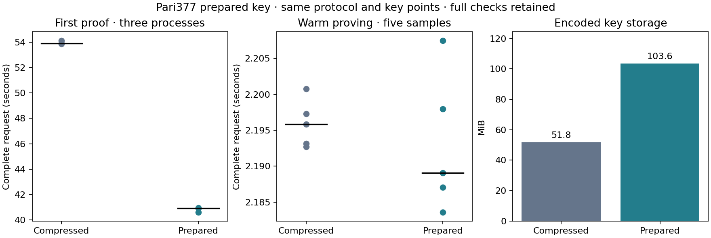

# Pari377 checked prepared-key storage

Retain this prepared storage option for development. In a matched two-worker diagnostic, the median of three fresh-process first proofs changes from **53.919482 to 40.921308 seconds** (24.11% lower). Complete warm proving remains 2.195858 versus 2.189084 seconds. This is a key-loading/storage experiment; the selected subset A/B/C comparison remains immutable.

| Measurement | Compressed subset key | Uncompressed prepared key |
| --- | ---: | ---: |
| First proof, three observations | 54.142734, 53.868925, 53.919482 s | 40.584887, 40.953187, 40.921308 s |
| First-proof median | 53.919482 s | 40.921308 s |
| Warm median, five observations | 2.195858 s | 2.189084 s |
| Warm peak process-tree RSS | 2.288 GiB | 2.311 GiB |
| First-proof peak RSS, maximum of three | 2.094 GiB | 2.195 GiB |
| Encoded key | 54,317,136 B | 108,633,744 B |
| Complete proof package | 168 B | 168 B |

The candidate’s ordinary loader accepts only `SHBUPK01`: the same checked compressed verifying key and canonical uncompressed G1 query/mask vectors. It avoids G1 decompression. Every point still receives the same deterministic curve/subgroup checks, per-point canonical round trip, bounded vector lengths and whole-key canonical round trip. Domain/index association, transcript, setup points and proof encoding are unchanged. Go resident arithmetic continues its existing independent checks. This experiment does not yet remove duplicate Rust/Go validation or resident base ownership.

The offline `prepare-key` importer fully checks the frozen compressed development key and the new representation, then requires exact equality of the verifying key and every witness, quotient, opening and mask point. Its typed record reports checked source import 28.889625s, encoding 0.070493s and prepared-key checked decode plus equality 16.627513s. File writes and record hashing are outside those stage values. Preparation is separate from ordinary first use. Keeping both encodings costs 162,950,880 bytes; the existing resident-arithmetic base files are shared unchanged, with a new manifest binding the new key-file hash. No setup ceremony or new cryptographic key is generated.

The 13 release tests pass, including uncompressed/compressed acceptance parity over more than 190 valid and torsion/mixed-subgroup cases, off-curve rejection, malformed field/flag/identity/length inputs, all six query/mask key slots, key/domain/mapping/proof negatives, and transport checks. The first importer build failed on private-field access; its source/log are retained and the corrected build uses the checked descriptor. All six complete logical-witness API scenarios pass, with wrong-domain/statement, malformed proof and invalid-witness rejection before timing.

The timing run produces 22 fresh individually verified proofs: three warmups, five warm and three fresh-process first proofs per variant. The original 18 paired-session proofs also verify under the other representation’s worker, confirming actual full-key/proof interoperability. The additional four first proofs use separate sequential process lifetimes. Startup order is candidate/control, control/candidate, candidate/control. Warm blocks alternate order; both workers are resident, only one proves at a time. Each fresh-process observation includes compile, file read, all checked loading, arithmetic preparation, witness processing and the first proof. Verification is outside proving timers.

The M4 Pro has 48GiB RAM; Go/Rayon use two workers. Guards exit zero with no swap or competing heavy jobs. First use does not flush the OS page cache. Three first observations and five warm samples are descriptive, with no cold-tail, p95, statistical confidence, physical-phone or network-throughput claim. Production release-gated prover tests and formal certification were not run.

The [compact checkpoint](../../tools/proving-experiment/checkpoints/2026-09-14-prepared-key/README.md) retains raw observations, source/lock/binary/key identities, gate evidence and proof hashes. Generated binaries, keys and proofs stay in the ignored cache. This completes the bounded storage-format experiment; further ownership and circuit/arithmetic branches remain in the campaign ledger.

