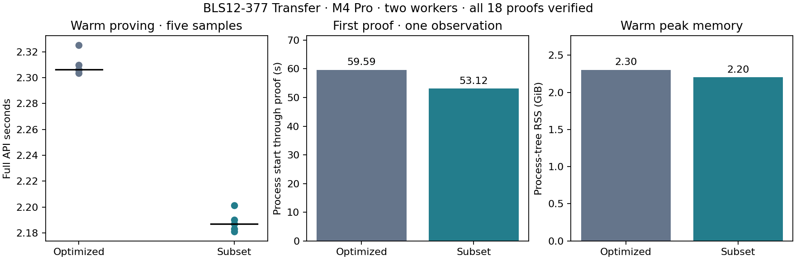

# Subset-domain ZK-Pari377 proving

Retain this development candidate for the final comparison. The matched full-API warm median improves **5.18%**, from 2.306158 to 2.186758 seconds. The reduction exceeds the predeclared 3% selection threshold; each of the five matched warm pairs improves. A fair corresponding gnark Groth16 domain experiment remains necessary before any claim of an intrinsic Pari advantage.

| Measurement | Existing optimized Pari377 | Subset Pari377 |
| --- | ---: | ---: |
| Warm median | 2.306158 s | 2.186758 s |
| Fresh-process first proof, one observation | 59.591334 s | 53.121948 s |
| Warm peak process-tree RSS | 2.301 GiB | 2.202 GiB |
| Encoded development proving key | 60,608,812 B | 54,317,136 B |
| Resident arithmetic bases | 121,216,128 B | 108,633,216 B |
| Complete individual proof package | 168 B | 168 B |

The M4 Pro has 48 GiB RAM. Both workers use two Go/Rayon workers, the same selected-before-DH Transfer relation, Go witness decoder/solver and combined Go MSM engine. One proof runs at a time. Each backend receives three warmups, five measured warm requests and one fresh-process first proof; warm backend order alternates. All 18 freshly randomized proofs verify individually outside the proving timer and have unique bytes. Full wall time includes witness construction/solving, checked bridge, polynomial work, arithmetic IPC, encoding and cleanup. The process guard records zero swap and no competing heavy jobs.

Five warm values are descriptive diagnostics, not reliable tail or confidence estimates. First use is one observation per variant and includes checked key loading and arithmetic preparation; the OS page cache was not flushed. The earlier A/B/C matrix is immutable and its samples are not pooled here. This report contains no physical-phone, validator or payment-throughput measurements.

## Exact domain change

The BLS12-377 relation remains 155,122 original R1CS rows, 226,578 outlined square-R1CS rows and 214,084 witness columns. The original canonical R1CS hash is `cc0dc2091c86777dfd21128b974d1a51f959ce0599211d90a022e5c3d9e27bde`. The setup checks the actual canonical matrix index against the frozen baseline key before generating fresh development keys.

The FFT size remains 262,144. Excluding the 32,768 roots whose indices are 1 modulo 8 leaves a 229,376-point domain and 2,798 padding rows. Weighted interpolation and exact division by the excluded-coset vanishing polynomial produce the retained-domain interpolants. The quotient uses a disjoint full-size coset, after explicitly checking every real and padding row. The actual retained-domain vanishing polynomial is used in setup, both masks, quotient and openings; public-input Lagrange evaluations use retained-row ordinals.

The candidate has a distinct key codec and proof-package marker. Its domain descriptor and complete verifying key seed a separate transcript. Setup weights and all commitment bases are regenerated; old keys are not truncated. The Q/A/R queries contain 131,072 fewer bases in total. The complete polynomial phase adds about 20–25 ms in the preceding six-assignment screen; the full API result includes that cost and the shorter MSMs. Fresh setup took 4.404768 s, excluding 2.239826 s relation preparation, and is separate from first-proof timing.

## Correctness and evidence

Twelve release tests pass: original mapping/field boundaries, lowering, retained/excluded-root interpolation and Lagrange evaluations, small complete proofs, wrong domain/key/row mappings, malformed proof encodings, subgroup/torsion rejection in every new key vector and mask slot, and bounded worker frames. A deliberately invalid low-degree coset relation is rejected by row checking before quotient computation.

All six real solved Transfer assignments produce verified proofs, with changed statements, wrong keys, altered constrained witnesses and malformed encodings rejected. All six logical-witness full-API scenarios also pass, including wrong-domain rejection for otherwise valid proofs and invalid logical-witness rejection. The standard regulated measurement follows these gates. Checked key decoding retains canonical, curve and subgroup validation; all Go bases are hash-bound to the actual new key. These checks do not constitute a formal soundness proof or production adoption. Production release-gated prover suites and phone tests were not run.

Raw records, exact source archives/locks, guarded build/test/run logs and hashes of retained keys and gate proofs are in [the compact checkpoint](../../tools/proving-experiment/checkpoints/2026-09-14-subset-proving/README.md). Large generated artifacts remain in the ignored cache. Reproduce report rendering with `tools/zkpari-spike/cache/venv/bin/python tools/proving-experiment/report_subset.py`.

