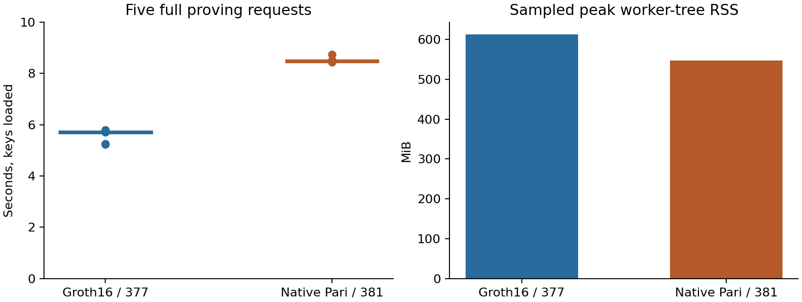

# Controlled phone proving comparison

On the physical Samsung SM-G781W (SM8250, Android 13/API 33, about 5.50 GiB RAM),
optimized Groth16/BLS12-377 took **5.71 s** and native Pari/BLS12-381 took **8.48 s**
per complete key-loaded standard Transfer request. Pari was **48.6% slower**,
with lower sampled worker memory in this screen.

| Backend | Warm median | Five-sample range | Sampled peak worker-tree RSS |
| --- | ---: | ---: | ---: |
| A: optimized Groth16/BLS12-377 | 5.708 s | 5.235–5.799 s | 612.7 MiB |
| C: native Pari/BLS12-381 | 8.484 s | 8.435–8.747 s | 546.5 MiB |
| B: Pari/BLS12-377 lifetime variant | Not measured | Phone asleep at follow-up preflight | Unknown |

The primary clock excludes key loading. It includes checked witness decoding,
construction/solving, mapping, local worker IPC, proving and output encoding.
Verification is outside the proving clock. A and C ran sequentially with two
Go/Rayon workers, two excluded warmups and five measured requests each. These
are a compact phone screen, not reliable tail estimates or a randomized trial.
C preserves the logical Transfer facts but changes the field and statement hash;
it is not a drop-in implementation of the BLS12-377 relation.

## Initialization, separately

| Backend | Reported initialization | Fresh-process first use, including first proof |
| --- | --- | ---: |
| A | Compilation 9.160 s; key loading 54.671 s | 69.224 s |
| C | Complete initialization 44.904 s; includes checked key decode 39.444 s | 53.403 s |

Each first-use value is a single observation. Artifact validation before the
clock can warm the operating-system file cache. These are not cold-storage
measurements. Initialization components are not subtracted to fabricate a
separately measured first loaded request.

## Correctness and resource evidence

A reused its six successful semantic gates only after matching the worker,
keys, dependencies, command, witnesses and statements against the original
configuration. Only supervisor and resource-policy changes were excluded from
that equivalence check. C passed six fresh scenario gates and negative cases.
The clean run produced 22 new randomized proofs, including gates, first-use
requests and warmups; every proof was individually verified. Each measurement
backend produced eight distinct proof hashes.

Stage-aware admission required 1,152 MiB available for A and 1,408 MiB for C.
The supervisor checked a 512 MiB available-memory floor every 250 ms and stopped
only its own process group on resource pressure or severe thermal status.
Minimum observed available memory was 1.546 GiB for A and 1.441 GiB for C.
Observed thermal readings were zero; unavailable initial readings remain unknown.
Every positive worker RSS sample was complete. RSS samples cover initialization
and proving, exclude the supervisor, and can miss transient peaks.

Focused Go supervisor tests passed, and an actual Android parent/child RSS probe
passed before measurement. The screen was awake at each stage admission with an
authorized temporary 30-minute timeout. The controller restored the original
120,000 ms timeout and verified its readback. No production release-gated prover
suite or formal certification ran as part of this phone screen.

[Machine-readable summary and retained raw records](../../tools/proving-experiment/checkpoints/2026-09-14-phone-controlled/summary.json)
bind source, binary, configuration and sample hashes. Proof bytes remain in
ignored cache storage. The [initial diagnostic checkpoint](phone-proving-checkpoint.md)
is excluded from this comparison. The [B lifetime candidate](pari-phone-memory.md)
has desktop correctness and memory evidence but no Android timing yet.

This phone screen measures proving, not validator throughput or payment TPS.
The original SnarkPack-versus-Pari batch experiment remains a separate result;
these optimized phone backends must not be substituted into its measurements.
