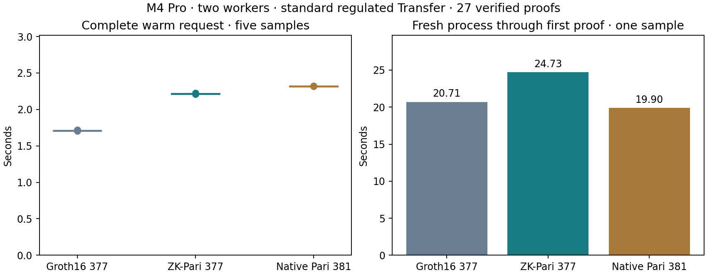

# Matched Transfer proving after comparator optimization

**Groth16/BLS12-377 has the lowest observed warm proving latency in this desktop comparison.** Warm medians are A1.709826s, B2.214584s and C2.319087s. Relative to A, B takes29.52%longer and C takes35.63%longer. Every timing proof verifies.

| Candidate | Warm median(s) | Five-sample range(s) | First proof(s) | Warm peak RSS(GiB) | API package(bytes) |
| --- | ---: | ---: | ---: | ---: | ---: |
| A: Groth16/BLS12-377 | 1.709826 | 1.704360–1.720588 | 20.710457 | 0.598 | 436 |
| B: ZK-Pari/BLS12-377 | 2.214584 | 2.207890–2.224690 | 24.732464 | 2.397 | 168 |
| C: Native Pari/BLS12-381 | 2.319087 | 2.318415–2.322003 | 19.898102 | 1.132 | 218 |

M4 Pro, two workers with matched Go/Rayon settings. Each persistent worker completes three warmups and five measured standard-regulated Transfer requests. Backend order rotates across blocks; the process initialization order is A,B,C. One fresh-process first proof per backend includes process launch, circuit/key preparation and its complete first request. The operating-system page cache was not flushed. Small sample counts are a quick optimization screen: no p95, uncertainty interval or cold-tail conclusion is claimed.

The full request clock includes checked witness decoding, live construction/solving, all per-request mapping and foreign-process work, proving and output encoding. Proof verification occurs after that clock and must succeed before the sample is admitted. All27 proof packages (nine warmups, fifteen warm samples and three first proofs) are distinct and verified. Sample files, identities and raw process-tree memory records are retained; source and artifact hashes are checked before and after the run.

Five warm observations in execution order:

- A: 1.709826, 1.704360, 1.720588, 1.708964, 1.718541seconds.
- B: 2.215920, 2.208189, 2.224690, 2.214584, 2.207890seconds.
- C: 2.322003, 2.318901, 2.318415, 2.319087, 2.321153seconds.

A and B share the exact BLS12-377 strict-comparator Transfer relation:154224 R1CS rows and141728 wires, preserving the single public statement hash and all six original witness scenarios. A uses the selected gnark subset Groth16 setup/prover with M196608/N262144. B has224778 converted square rows/212280 witness wires and M229376/N262144, with the selected checked owned-admission arithmetic worker. B's complete implementation includes the earlier loader/ownership improvement; its startup number is not an isolated comparator effect.

C uses the native BLS12-381 Transfer relation with191516 square rows/191501 columns and M196608/N262144. It preserves the six native witness statements and the same source logical facts. Its field and statement bytes differ from A/B. The earlier isolated C comparison measured2.582560042→2.311950125s, a10.48%warm improvement; those samples remain separate from this matrix. [Targeted C report](native-comparator34-proving.md)

Stored development proving keys are A37457537bytes, B108460560bytes and C51671551bytes. B uses checked uncompressed prepared-key storage. Package sizes above are the complete development API encodings; they are not a SnarkPack aggregate-size or network-bandwidth measurement. One-time key generation is recorded separately in each setup checkpoint and excluded from request timing.

Correctness precedes timing. A's six fresh-key generation proofs and six full-API scenarios pass. B passes19 focused Rust tests including the real private-child failure test, six canonical-reference proof/mapping gates, six subset-protocol proof/negative gates, six exact seeded proof/combined-MSM equivalence cases, and six full-API scenarios. The seeded parity cases are excluded from the timing corpus. C's45 relevant release tests, six original/converted polynomial gates, six fresh-key proofs and six full-API scenarios pass. Full-API checks reject malformed/truncated/trailing proofs, changed statements, invalid witnesses and wrong keys or domains as applicable. The Go comparator tests and worker-frame test pass on the new A source. Four additional Commonware domain/batch tests and the WebAssembly cryptography build pass; the initial test-filter invocation selected zero tests and was corrected without changing source. Production release-gated prover suites and formal certification were not run in this round.

This report answers desktop proving cost. Physical-phone acceptability and production adoption remain follow-up decisions. The previous SnarkPack/verification campaign remains stopped and its corpora are unchanged; this round makes no validator-throughput or payment-TPS claim. These isolated development candidates do not alter the production backend.

[Raw checkpoint](../../tools/proving-experiment/checkpoints/2026-09-14-comparator-selected/README.md) · [Typed result](transfer-proving-comparator-selected.json) · [Matched runner](../../tools/proving-experiment/comparator_selected.py).

