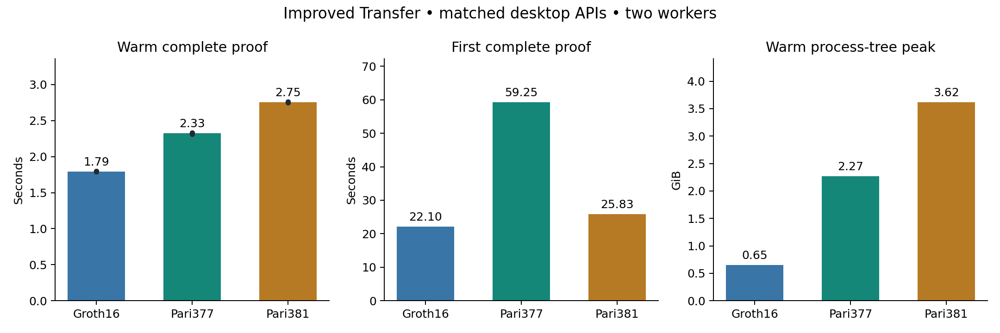

# Transfer proving — circuit and polynomial optimization round

**Groth16 remains the fastest prover in this desktop matrix.** ZK-Pari377 takes 1.30× its warm time; native Pari381 takes 1.54×. This concludes the implemented circuit, checked-loader and same-key polynomial round. Structured-domain protocol work and physical-phone measurements remain pending.

Apple M4 Pro, 48 GiB RAM, macOS, AC power. Two Go/Rayon workers and one active proof at a time. Standard regulated Transfer; three warmups, five measured warm proofs and one fresh-process first proof per backend. Every measured and warmup proof verifies with unique bytes. First use includes compilation/preparation, checked key loading, arithmetic tables and the first complete witness-to-proof request. The OS page cache was not flushed.

| Backend | Five warm values (s) | Warm median (s) | First proof (s) | Warm peak RSS (GiB) |
|---|---|---:|---:|---:|
| Groth16, improved Transfer | 1.7895, 1.8014, 1.7924, 1.7986, 1.7914 | 1.7924 | 22.1028 | 0.650 |
| ZK-Pari377, improved Transfer | 2.3268, 2.3334, 2.3241, 2.3136, 2.3338 | 2.3268 | 59.2497 | 2.272 |
| Native Pari381, affine Transfer | 2.7528, 2.7595, 2.7550, 2.7613, 2.7494 | 2.7550 | 25.8318 | 3.617 |

Five warm samples support a descriptive comparison, not reliable p95 or confidence-interval claims. Each first-proof result is one observation, not a cold-tail estimate. No desktop result establishes phone acceptability, validator throughput or payment TPS.

## Changes included

- A and B share the exact same improved gnark Transfer: three eligible audit tiers select their authenticated key before DH. Sender-core retains unconditional issuer detection. Original R1CS rows fall 163,396→155,122; B conversion has 226,578 rows and 262,144 FFT domain.
- B uses combined gnark377 MSM, deterministic checked G1 loading, prepared public-column polynomials and coset quotient computation. Every original-domain row is checked before coset interpolation. Public statements, canonical encodings and key/relation association remain checked.
- C uses complete affine Jubjub formulas at validated inputs, prepared/combined blst MSM and relation-bound public/coset preparation. Its relation has 220,009 rows and 220,029 columns, still on domain 262,144. The B-side mask remains in the quotient.
- New development keys are confined to the experiment cache. Production circuits, dependencies, keys and acceptance paths were not changed by this round.

## Footprint and setup

| Backend | Proving key (MiB) | Encoded proof package (bytes) | First-use peak RSS (GiB) |
|---|---:|---:|---:|
| A | 38.85 | 436 | 0.451 |
| B | 57.80 | 168 | 2.149 |
| C | 63.29 | 218 | 3.376 |

B additionally stores 116.80 MiB of encoded arithmetic bases. One-time development setup: A 26.486 s, B 4.859 s, C 29.530 s; these costs are outside proving samples. Prepared public columns and all first-use arithmetic preparation are included in the matrix initialization.
Across all resident workers, peak process-tree RSS was 6.970 GiB; minimum reclaimable memory 17.336 GiB; maximum swap 0 MiB. The guard completed without competing heavy jobs.

## Historical checkpoint

The prior selected desktop session remains immutable. Its values below are a separate historical session, not paired samples or pooled statistical evidence.

| Backend | Prior warm median (s) | This round (s) | Observed reduction |
|---|---:|---:|---:|
| A | 1.8455 | 1.7924 | 2.9% |
| B | 2.4765 | 2.3268 | 6.0% |
| C | 3.0290 | 2.7550 | 9.0% |

B first-proof observations were 89.81 s previously and 59.25 s here. Native Pari381 warm peak RSS increased from 2.66 to 3.62 GiB. This memory tradeoff is material; the session comparison does not isolate allocator effects from retained preparation.

## Verification and limits

All three selected workers passed six complete API scenarios plus altered/truncated/trailing proof, altered statement and invalid-witness rejection before this matrix. Original and converted assignments were checked in full. The gnark DH parity gate covers exact coordinates and encoding; malformed selected/unselected keys and existing tier/EPK/scalar/detection mutations reject.

The native candidate passed 41 release unit tests, including independent Arkworks group parity, relation-bound public preparation, coefficient-helper rejection and paired-mask proof equality. B passed 11 release bin tests and 11 example tests covering canonical decoding, deterministic subgroup checks, every key slice/mask and relation/assignment invariants. Six native full-Transfer paired-randomness comparisons produced identical complete proof bytes; warm measurement proofs used fresh randomness.

The first native control attempt reused the candidate binary through a same-name Cargo-package cache collision. Its timing reports were excluded. Unique package identities, expected circuit digests/row counts and executable hashes now distinguish the controls; a reproducing regression test rejects the recorded failure. Focused build failures and corrected runs are retained. Production release-gated prover suites and formal certification were not run; formal work stays in shieldd-security.

Structured subset domains passed synthetic full-size polynomial identities but are not integrated proof systems. Their extra polynomial work must be weighed against shorter commitments. The synthetic Groth16 product kernel is not the current gnark coset-N implementation, so it is not a production Groth16 slowdown estimate. The stopped SnarkPack/verification campaign and its two 4,096-proof corpora were not resumed.

## Evidence

- [Raw samples](../../tools/proving-experiment/cache/desktop-optimized/samples.jsonl), [analysis](../../tools/proving-experiment/cache/desktop-optimized/analysis.json), [completion hashes](../../tools/proving-experiment/cache/desktop-optimized/complete.json).
- [Source and executable manifest](../../tools/proving-experiment/cache/optimized-circuit-source/final-manifest.json), [campaign plan](zkpari-optimization-campaign.md), [prior desktop report](transfer-proving-selected.md).

