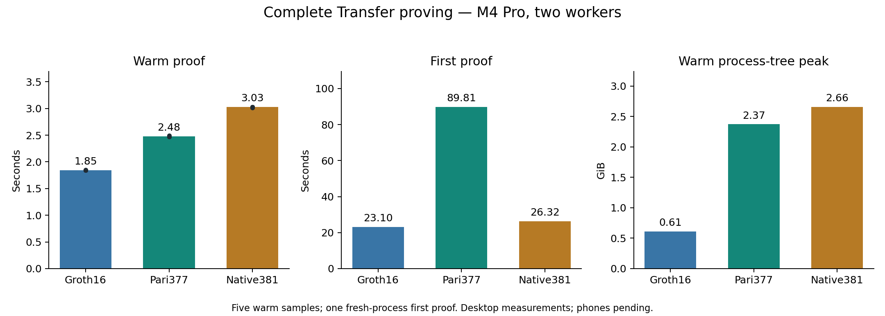

# Selected Transfer provers — matched desktop results

**Groth16 remains the fastest prover.** ZK-Pari377 takes 1.34× its warm time; native Commonware381 takes 1.64×. These are complete encoded-witness API measurements on the same desktop session.

Apple M4 Pro, 48 GiB RAM, macOS-15.7.7-arm64-arm-64bit-Mach-O, AC power. Two Go/Rayon workers, one active proof at a time. Standard regulated Transfer; two warmups and five measured warm samples plus one fresh-process first proof per backend. All 18 measured proofs and six warmups verify and have unique proof bytes.

| Backend | Five warm values (s) | Warm median (s) | First proof (s) | Warm peak RSS (GiB) |
|---|---|---:|---:|---:|
| Current Shieldd Groth16 | 1.8448, 1.8460, 1.8455, 1.8480, 1.8417 | 1.8455 | 23.0991 | 0.610 |
| ZK-Pari377, combined gnark arithmetic | 2.4896, 2.4783, 2.4698, 2.4728, 2.4765 | 2.4765 | 89.8052 | 2.373 |
| Native Commonware381, prepared blst | 3.0139, 3.0299, 3.0290, 3.0199, 3.0320 | 3.0290 | 26.3193 | 2.658 |

Warm requests include witness decoding, solving/construction, checked mapping, proving and encoding. B includes both Go solver and MSM transport. C includes scalar preparation and its complete native circuit. First proof includes fresh-process initialization, checked key loading and arithmetic-table/base preparation; offline key generation is excluded. The OS page cache was not flushed. One first proof and five warm observations support descriptive medians and ranges, not cold-tail/p95 or confidence claims.

## Startup and footprint

| Backend | Prover preparation (s) | Arithmetic preparation (s) | Additional resident bases/tables (MiB) | First peak RSS (GiB) | Key (MiB) | Witness / proof package bytes |
|---|---:|---:|---:|---:|---:|---:|
| A | 21.273 | 0.000 | 0.00 | 0.463 | 39.88 | 16204 / 436 |
| B | 68.382 | 18.934 | 116.98 | 2.199 | 58.49 | 16204 / 168 |
| C | 22.966 | 0.343 | 127.08 | 2.821 | 63.60 | 16297 / 218 |

B arithmetic preparation includes actual-key/base hash binding and Go checked loading; the Go child reports 18.352 s within that preparation. This extra loading is charged to first proof. C prepares its affine/index tables once from the checked key. The ordinary proving APIs retain fresh random masks and the required transcript/commitment work.

RSS is sampled every 100 ms per process tree; B includes both Go children. It is an observed peak, not an allocator guarantee. All workers remain resident for warm comparison; shared pages may be counted more than once. Combined campaign peak is 6.071 GiB, minimum reclaimable memory 17.040 GiB, maximum swap 0 bytes, with no competing heavy workload or resource interruption.

B currently requires an additional 118.20 MiB of encoded arithmetic base files (123,938,452 bytes), derived from its key, in this development runner. Their checked loading is included above. C derives its prepared tables in memory and needs no additional encoded base files. These are startup/storage costs, separate from transmitted proof packages.

Proof packages retain each measured API encoding: A uses its shipping wrapper, B includes its statement and compressed proof, C includes the claim and required committed-input commitment. Package bytes are not normalized theoretical proof sizes.

## Decision and correctness

Retain Groth16 as the proving baseline. B is the stronger proving candidate among these two ZK-Pari routes, but its startup and memory cost must be included in a device decision. Native C does not establish a proving advantage sufficient to justify replacing the stack. Validator verification and SnarkPack aggregation are separate costs; this proving run does not decide the protocol-throughput tradeoff.

B retains the exact BLS12-377 gnark Transfer relation and statement; only development arithmetic changes. C retains the previously checked complete native Transfer obligations, field-specific hashes, circuit and keys. The first B transport gate rejected an older helper without combined operations; no proof or timing was admitted. A reproducing binary-identity test caught that configuration, and the corrected gate uses the previously validated combined helper. Both selected worker binaries pass all six real-proof scenario gates plus altered proof, wrong statement, truncation and invalid-witness checks before measurement. Every timed and warmup proof is individually checked outside its proving timer.

This pass ran eight B release example tests, one C release transport test, six focused Python checks, and both selected six-scenario real-proof gates. Prior original/converted relation, wrong-key, semantic and arithmetic-parity gates remain recorded in the optimization ledger. Production release-gated prover suites and formal certification were not run; formal work belongs in shieldd-security.

The one gnark381 arithmetic control is closed: its 0.146576 s summed saving would project only about 4.9% off the earlier C API, and does not justify another Go runtime in the selected implementation. It is not a full-proof result. Affine/shared-square gadgets, corrected hinted multiplication, alternative domains and Edwards MSM remain deferred; no unmeasured circuit saving is added to these results.

**Physical-phone acceptability remains unknown.** No Android device is attached and full Xcode is absent on this host. Desktop ARM results are not phone measurements. No payment TPS or production-readiness claim follows.

The earlier desktop-final report and frozen sources remain unchanged. Its samples are a historical checkpoint, not pooled with this session. The stopped SnarkPack/ZK-Pari campaign and its 4,096-proof corpora were not resumed.

## Reproduction and evidence

- [Raw samples](../../tools/proving-experiment/cache/desktop-selected/samples.jsonl), [machine-readable analysis](../../tools/proving-experiment/cache/desktop-selected/analysis.json), [completion hashes](../../tools/proving-experiment/cache/desktop-selected/complete.json).
- [Selected source archive manifest](../../tools/proving-experiment/cache/desktop-selected-source/manifest.json), [worker/gate commands](../../tools/proving-experiment/README.md), [optimization ledger](../../tools/proving-experiment/optimization-ledger.md).
- [Earlier desktop checkpoint](transfer-proving-results.md), [B arithmetic evidence](../../tools/proving-experiment/gnark-msm-probe.md), [C arithmetic evidence](../../tools/proving-experiment/native-prepared-msm.md).

Cache evidence is local and ignored by Git. Analysis reads and validates the completed run without regenerating proofs. Source archives, exact binary hashes, locks, keys, fixture hashes, raw samples and the guarded resource logs are retained.
