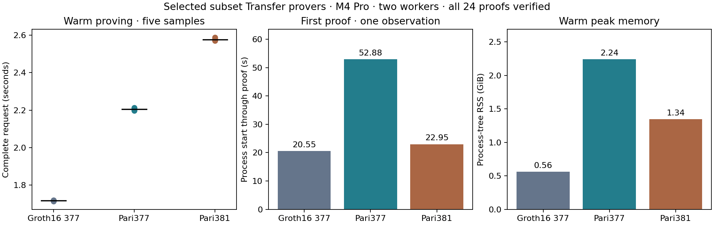

# Selected subset Transfer proving comparison

Groth16 remains the fastest prover in this matched desktop round. Pari377 takes **1.28×** its warm proving time; native Pari381 takes **1.50×**. These are complete proving requests, not validator verification or payment throughput.

| Selected experimental prover | Warm median | Fresh-process first proof | Warm peak RSS | Proof package |
| --- | ---: | ---: | ---: | ---: |
| Groth16 / BLS12-377 | 1.716633 s | 20.545929 s | 0.560 GiB | 436 B |
| ZK-Pari / BLS12-377 | 2.204663 s | 52.882439 s | 2.238 GiB | 168 B |
| Native Pari / BLS12-381 | 2.575632 s | 22.951463 s | 1.344 GiB | 218 B |

All 24 fresh proofs verify individually: two warmups, five measured warm proofs and one fresh-process first proof per candidate. The representative scenario is standard regulated Transfer. All six scenarios and candidate-specific negatives passed the separately saved full-API gates before this run; their source, key, binary, witness and evidence hashes are revalidated before measurement. Native C uses the corresponding native witness, with its source-witness hash checked against A/B.

The M4 Pro has 48 GiB RAM. Go and Rayon use two workers; Cargo jobs are limited to two. Persistent workers are resident together, but only one proof is active at a time. First use is measured immediately after each fresh process starts, including compilation, checked key loading and preparation. Warm time includes logical-witness decoding/construction, solving, mapping or conversion, polynomial arithmetic, IPC where applicable, MSMs and output encoding. Individual verification follows outside the timer. RSS is sampled process-tree memory, including B’s child solver and arithmetic worker.

Warmups use CBA then ABC order; the five measured blocks use ABC, BCA, CAB, CBA, ACB. The order rotates and reverses but five blocks cannot place every candidate equally often in every position. Earlier pair sessions and A/B/C matrices remain immutable and are not pooled. Guard exit is zero, with zero swap and no detected competing heavy work.

| Prover | Five warm observations (seconds) |
| --- | --- |
| A | 1.718627, 1.716633, 1.715641, 1.714001, 1.718844 |
| B | 2.212381, 2.211023, 2.196887, 2.204663, 2.199675 |
| C | 2.581329, 2.587196, 2.575632, 2.570797, 2.572551 |

Five warm samples support a descriptive comparison, not p95 or strong confidence claims. First proof is one observation per candidate; the OS page cache was not flushed. These are desktop results. Physical phone latency and memory remain unmeasured.

## What is selected

A uses the selected-before-DH gnark circuit over BLS12-377 and its fully integrated subset QAP: M196608 retained rows within an N262144 FFT. The standard Groth16 proof format and verifier remain unchanged, with fresh development keys for the changed QAP. The relation contains 155122 R1CS constraints.

B uses that same circuit and solver, the exact square-R1CS conversion (226578 rows), checked G1 decoding, prepared public polynomials and coset quotient, and combined gnark377 MSM arithmetic. Its complete subset protocol uses M229376/N262144 with a separate key codec and transcript binding. All witness/bridge costs remain in the request. The B solver binary retains its separately gated artifact set; it does not substitute A’s new Groth16 proving key.

C uses the full native affine Transfer over BLS12-381/Jubjub, prepared blst arithmetic, checked lifetime reclamation and its complete subset protocol. It retains 220009 real rows and 220029 real columns with M229376/N262144. The unchanged rows/layout reproduce the previous relation digest when rehashed under the previous domain namespace. Its curve and hashes differ from A/B; it is a semantically corresponding experimental protocol, not a drop-in production backend.

| Prover | Encoded proving key | One-time setup |
| --- | ---: | ---: |
| A | 37,587,069 B | 24.318608 s |
| B | 54,317,136 B | 4.404768 s |
| C | 60,078,047 B | 25.121745 s |

Setup values come from each candidate’s retained development setup record and were not rerun in this matched session. Compilation is separate from those setup values. Proof package bytes include each experiment’s wrapper and statement, not just cryptographic points. Keys and proof packages therefore have explicitly different formats.

## Evidence and remaining decisions

The preceding candidate gates include four focused gnark subset tests and three Go worker tests; twelve subset377 release tests; 44 native release tests and three focused prepared/domain-audit tests. Each candidate passed all six complete Transfer positive/negative API gates, including invalid witnesses and malformed proofs. Subset-specific domain/key/row mapping, masks, public polynomial and canonicality checks are recorded in the individual reports. This final session reuses those gates after identity validation and verifies all new proofs; it does not rerun the production release-gated prover suite or establish formal certification.

The circuit, checked loading, lifetime, polynomial and first subset-domain round is complete and all three selected workers are retained. The broader campaign remains active: B’s checked first-use and duplicated key/base ownership are the next bounded target. Correctly constrained hinted multiplication, exact hash/compiler reuse and selected arithmetic feasibility remain explicit research branches, not claimed exhausted. Production adoption and physical-phone measurements remain separate decisions. The stopped historical verification/SnarkPack campaign was not resumed.

Raw samples, source and artifact identities, proof hashes and resource evidence are in [the compact checkpoint](../../tools/proving-experiment/checkpoints/2026-09-14-subset-selected/README.md). Candidate reports: [A subset](groth16-subset-proving.md), [B subset](pari-subset-proving.md), [C subset](native-subset-proving.md). Generated binaries, keys and proofs remain in the ignored local cache.

